# AsterFSD Platform Architecture Diagrams

这份文档是 RFC-0001～RFC-0009 的视觉索引。图中的服务、队列和数据库代表 ownership 与数据流，不代表每个 Profile 必须拆成独立 Pod。

相关 RFC：

- [RFC-0001：Platform Architecture](rfcs/0001-asterfsd-platform-architecture.md)
- [RFC-0002：Technology Stack and Infrastructure Profiles](rfcs/0002-technology-stack-and-infrastructure-profiles.md)
- [RFC-0003：Identity and Trust Architecture](rfcs/0003-identity-and-trust-architecture.md)
- [RFC-0004：Network Runtime, Sharding and High Availability](rfcs/0004-network-runtime-sharding-and-high-availability.md)
- [RFC-0005：Event Model and Delivery Semantics](rfcs/0005-event-model-and-delivery-semantics.md)
- [RFC-0006：History, Replay and Telemetry Architecture](rfcs/0006-history-replay-and-telemetry-architecture.md)
- [RFC-0007：Activity and Dispatch Integration](rfcs/0007-activity-and-dispatch-integration.md)
- [RFC-0008：Weather, AIRAC and Route Data Plane](rfcs/0008-weather-airac-and-route-data-plane.md)
- [RFC-0009：ATC Coordination and Handoff State Machine](rfcs/0009-atc-coordination-and-handoff-state-machine.md)

## 1. 一张图看完整个平台

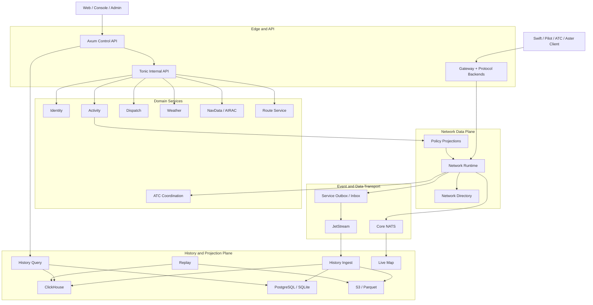

## 2. 服务 ownership 图

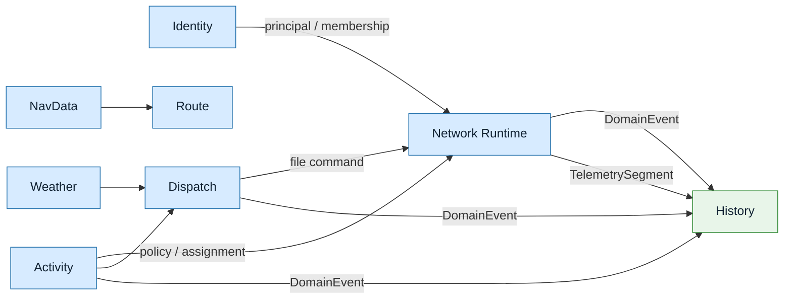

| 服务 | 权威内容 | 下游消费者 |
| --- | --- | --- |
| Identity | Account、Membership、Rating、Permission | Gateway、Activity、Dispatch、History |
| Network Runtime | session、callsign、position、在线 flight plan、live handoff | Gateway、Map、History |
| Activity | 活动、报名、slot、assignment、policy | Runtime、Dispatch、History |
| Dispatch | FlightRequest、Release revision、filing projection | Network Control、History |
| Weather | observation、forecast、freshness、provenance | Runtime、Dispatch、History |
| NavData | AIRAC cycle、bundle、overlay、generation | Route、Dispatch、History |
| Route | candidate、validation、engine result | Dispatch、Web |
| History | timeline、track、replay、archive、read model | Web、Activity、Dispatch、运营方 |

## 3. 三种部署 Profile

### 3.1 Standalone

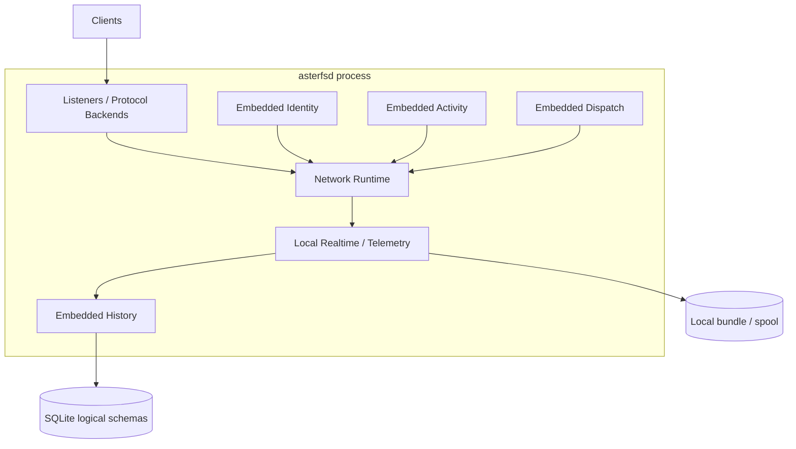

Standalone 是完整架构的 `ShardId(0)`，不是功能阉割版。外部 NATS、PostgreSQL、ClickHouse 和 Kubernetes 属于可选基础设施。

### 3.2 Distributed Compact

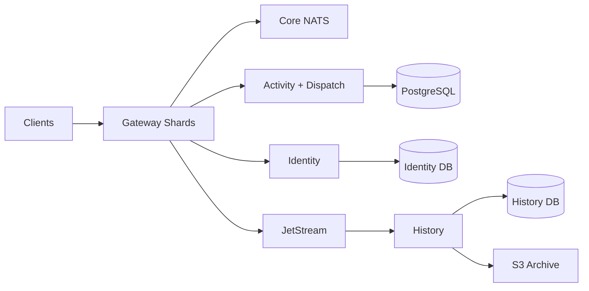

### 3.3 Kubernetes Large

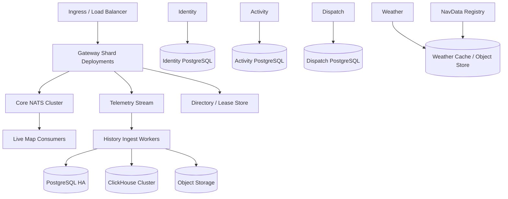

Kubernetes 只改变部署和故障域，Command/Event/Query/Telemetry contract 与 Standalone 保持一致。

## 4. 一次登录与在线状态

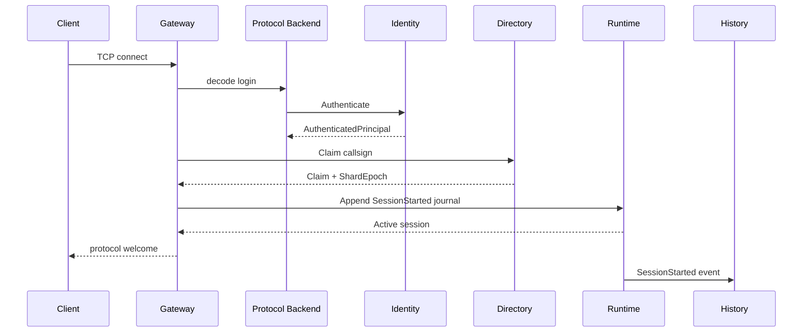

密码、app password、session ticket 只存在于 decode → authenticate 最短链路。

## 5. 一次 position 更新

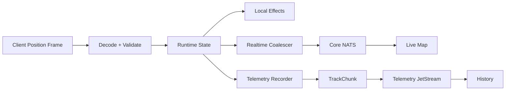

position 热路径：

```text
decode -> validate -> local state -> local delivery -> bounded recorder offer
```

同步数据库、Identity、Directory、History 和 JetStream ack 均位于该路径之外。

## 6. Activity、Dispatch、Network filing

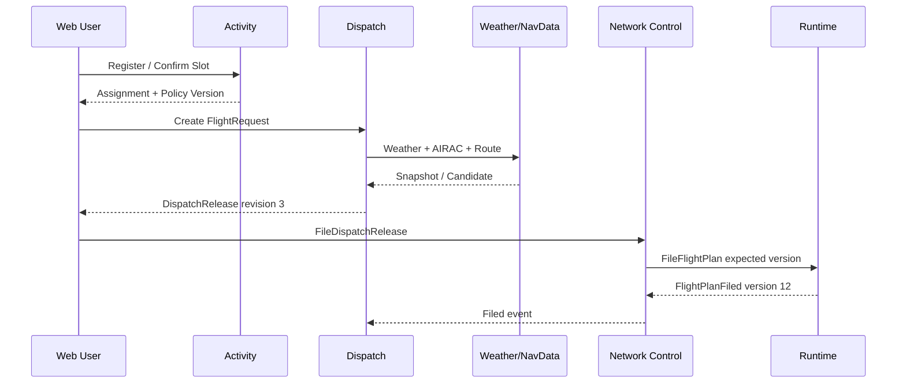

```text
Activity assignment != Dispatch Release != Network FlightPlan
```

## 7. Weather、AIRAC 与 Route

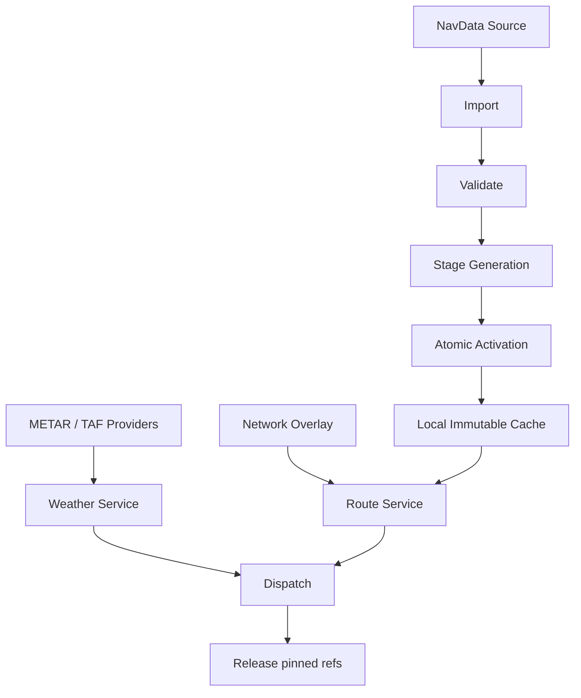

```text
DispatchRelease
├── WeatherSnapshotRef
├── AiracCycleRef
├── OverlayGeneration
├── RouteEngineVersion
└── RouteChecksum
```

## 8. Event transport

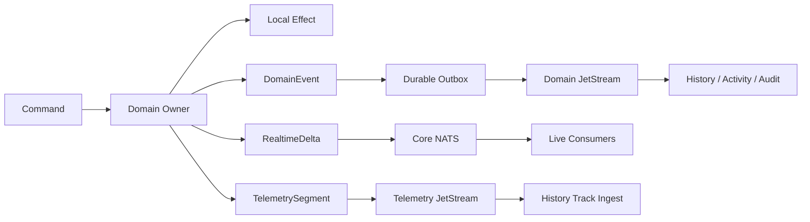

| 类型 | 交付 | 失败处理 |
| --- | --- | --- |
| Command | gRPC/HTTP/local port | typed error、deadline、idempotency |
| Query | gRPC/HTTP/stream | cursor、limit、cancel |
| RealtimeDelta | Core NATS | gap、coalesce、snapshot |
| DomainEvent | outbox + JetStream | redelivery、inbox、version |
| TelemetrySegment | bounded recorder + telemetry stream | spool、sampling degradation、gap |
| Snapshot | object/DB/checkpoint | checksum、generation、rebuild |

## 9. ATC handoff

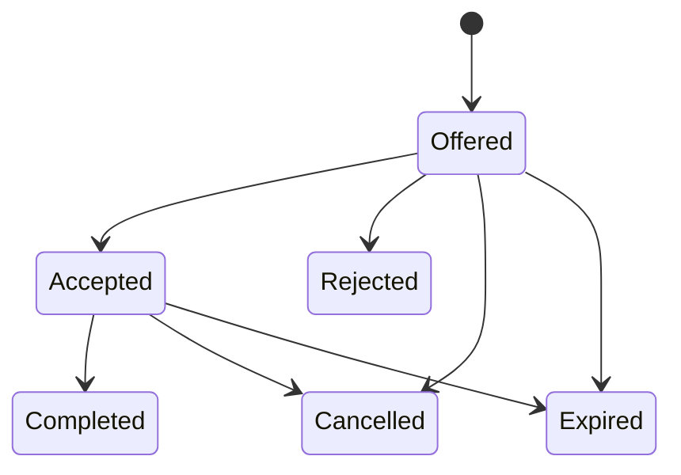

```text
Classic $HO/$HA
  -> Classic backend mapping
  -> typed HandoffCommand
  -> Runtime coordination state
  -> direct/audience effect
  -> Classic exact wire
```

旧 ConnectionRef、旧 ShardEpoch、过期 HandoffVersion 都经过 fencing/version 校验。

## 10. History、Replay 与 Archive

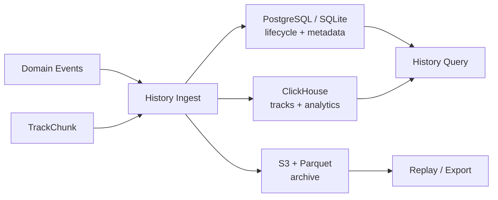

```text
ReplayManifest
├── event checkpoint
├── track watermark
├── snapshot refs
├── schema versions
├── storage generation
├── gap intervals
└── checksum
```

Replay 返回明确的 gap、watermark 和 consistency mode，不将展示插值伪装成 recorded sample。

## 11. 依赖方向

```text
aster_fsd_model
    ^
    +-- aster_fsd_codec
    +-- aster_fsd_protocol*
    +-- aster_fsd_auth
    +-- aster_fsd_activity
    +-- aster_fsd_dispatch
    +-- aster_fsd_weather
    +-- aster_fsd_navdata
    +-- aster_fsd_route
    +-- aster_fsd_history
            ^
            +-- persistence adapters
            +-- protocol/service adapters
            +-- composition root
```

硬边界：

- core 不依赖具体 protocol、Activity、Dispatch、Weather provider 或数据库；
- backend 不访问数据库和全局 registry；
- History 不写 Runtime current state；
- Activity/Dispatch 不直接写 Network Runtime；
- adapter 负责 transport、认证、错误映射和观测；
- 所有跨服务消息带 Network scope、version 和 authorization context。

## 12. 运行时故障边界

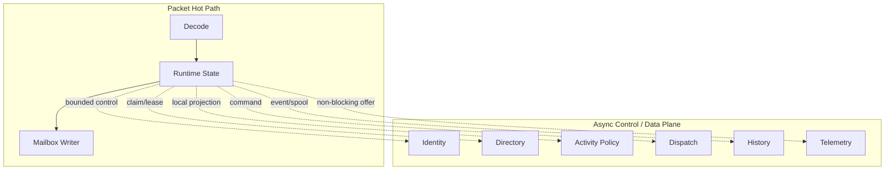

依赖故障首先表现为对应领域的 lag、degraded、backpressure、stale 或 policy state；故障传播需要经过明确 admission/lease/queue 边界。

## 13. 相关规范

图册只提供结构索引，字段、错误、阈值和测试要求以 RFC 正文为准。新增服务需要回答：

1. 它拥有什么权威状态？
2. 它消费哪些 command/event/query？
3. 它的热路径在哪里？
4. 它的 durable boundary、outbox 和 replay source 是什么？
5. 它如何隔离 Network、Membership 和 service credential？
6. Standalone/Distributed/Kubernetes 如何保持同一 contract？
