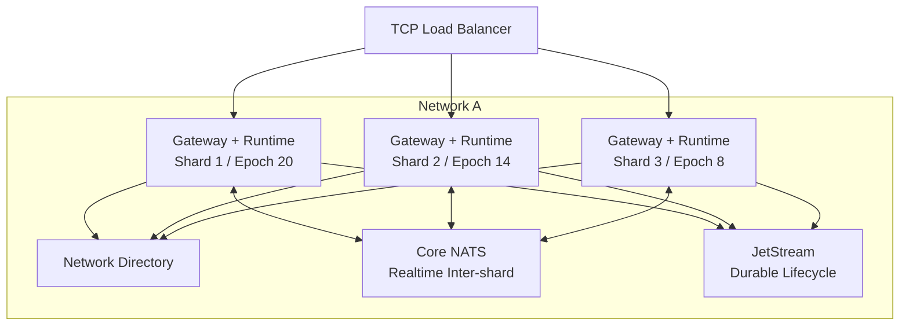

# RFC-0004：Network Runtime, Sharding and High Availability

| 字段 | 内容 |
| --- | --- |
| 状态 | Proposed |
| 日期 | 2026-08-17 |
| 负责产品组 | AsterFSD Platform |
| 影响范围 | Gateway、Network Runtime、Network Directory、shard、跨 shard routing、HA、drain、snapshot 和 Kubernetes |
| 上位 RFC | [RFC-0001](0001-asterfsd-platform-architecture.md)、[RFC-0002](0002-technology-stack-and-infrastructure-profiles.md)、[RFC-0003](0003-identity-and-trust-architecture.md) |
| 相关 RFC | [RFC-0001](0001-asterfsd-platform-architecture.md)、[RFC-0002](0002-technology-stack-and-infrastructure-profiles.md)、[RFC-0003](0003-identity-and-trust-architecture.md)、[RFC-0005](0005-event-model-and-delivery-semantics.md)、[RFC-0006](0006-history-replay-and-telemetry-architecture.md) |
| 核心原则 | 单写入者、明确 ownership、epoch fencing、有界热路径、真实重连语义 |

## 1. 摘要

Network Runtime 是 AsterFSD 的实时状态权威。它处理 session、callsign、position、flight plan、routing、handoff 和 protocol delivery。为支持一个 Network 的单机部署和大型平台的水平扩展，本 RFC 定义 Gateway/Runtime shard、Network Directory、跨 shard routing、epoch/fencing、状态恢复和高可用语义。

本 RFC 不把 Gateway 做成完全无状态的 HTTP Pod，也不把每个 packet 送到一个独立 Core service。一个 Gateway shard 同时拥有它接受的 TCP connections 和对应的 Network Runtime state，从而避免 position 热路径的额外 RPC、序列化和全局锁。

```text
Standalone:
  NetworkId(DEFAULT) -> ShardId(0) -> one process

Distributed:
  NetworkId(A) -> ShardId(0..N) -> Gateway + Runtime per shard

Control Plane:
  Network Directory -> callsign claims / shard epochs / drain

Realtime:
  local state -> local delivery + Core NATS inter-shard delta

Durable:
  session/flight-plan/handoff lifecycle -> JetStream/History
```

关键决策：

1. 一个 Gateway runtime/shard 在生命周期内只服务一个 `NetworkId`。
2. Gateway 与 Runtime 在同一 shard 共置；跨服务 gRPC 不进入每个 position packet 的同步路径。
3. `NetworkDirectory` 只负责低频 shard ownership、callsign claim/release、epoch 和 drain，不负责实时 position 状态。
4. callsign 唯一性按 `(NetworkId, normalized_callsign)` 维护；不同 Network 可以同时使用同一 callsign。
5. `ShardEpoch` 是所有跨 shard delivery 和 claim mutation 的 fencing token；旧 shard 即使恢复也不能继续写。
6. 跨 shard realtime 使用 Core NATS；durable session/flight-plan/handoff lifecycle 使用 JetStream/History。
7. Core NATS、Directory 或 History 故障不能同步阻塞本地 packet dispatch；Directory lease 失效后 shard 必须 self-fence，防止 split-brain。
8. TCP 连接故障后使用客户端重连，不承诺 socket 无感迁移；状态恢复只恢复允许恢复的业务数据，不复活旧 `ConnectionId`。
9. 单 shard 是正式的 `ShardId(0)` Profile，不是另一套实现。
10. 所有队列、mailbox、inter-shard buffer 和恢复 spool 有界，position 可以合并，durable event 不能无限堆积。

## 2. 背景和问题

当前 Network Runtime 以进程内 registry 管理连接、callsign、position 和 effect。小型 FSD 网络可以由一个进程承担，但平台化后会遇到：

- 一个 Network 需要多个 Gateway Pod；
- listener 接受连接的 Pod 不一定是 callsign target 所在的 Pod；
- direct、`*`、`*A`、`*P` 和 range routing 需要跨 shard；
- callsign claim 不能只靠本地 HashMap；
- Pod crash 后 TCP 已经断开，不能假装连接自动迁移；
- rolling upgrade 不能把所有已连接客户端一起瞬间杀掉；
- shard 网络分区可能让两个进程同时认为自己拥有同一 callsign；
- position 高频更新不能每包写数据库或等待 broker ack；
- Identity、NATS、Directory 和 History 的故障语义必须各自明确。

如果只在现有 `Network` 外面加负载均衡，会出现：

- duplicate callsign；
- stale shard 继续广播 position；
- old Pod 在新 Pod 接管后覆盖 state；
- cross-shard direct delivery 找不到 recipient；
- slow NATS consumer 反向堵塞所有连接；
- drain 结束后仍然有旧 shard 发送 event；
- restart 后把旧 ConnectionId 当作当前 session；
- snapshot 被误当成完整的 active TCP session transfer。

## 3. 术语和边界

### 3.1 Network Runtime

拥有当前实时网络状态的逻辑组件：

- session phase；
- active principal；
- callsign ownership；
- current position；
- current flight plan；
- route/delivery decision；
- handoff state；
- connection mailbox 和 lifecycle。

Network Runtime 不拥有：

- Web Account/credential；
- Identity ORM entity；
- 长期 History；
- NATS cluster configuration；
- raw protocol string contract。

### 3.2 Gateway Shard

一个逻辑部署单元，包含：

```text
Gateway Shard
├── protocol listeners
├── connection supervisor
├── Network Runtime state owner
├── local callsign/session indexes
├── local recipient resolver
├── bounded mailboxes
├── inter-shard transport adapter
└── shard lease/epoch client
```

Gateway Shard 不是无状态 edge proxy。它拥有连接和实时 state，直到 drain、crash 或 epoch 被撤销。

### 3.3 ShardId 和 ShardEpoch

```text
ShardId
  Network 内逻辑分片标识，可在重启后复用

ShardInstanceId
  一次进程/Pod 实例的唯一标识

ShardEpoch
  Directory 分配的单调 ownership fencing token
```

`ShardId` 表示“哪一片”，`ShardEpoch` 表示“当前哪一代实例有权写”。

### 3.4 NetworkDirectory

Network Directory 是低频 ownership service：

- register/renew/drain shard；
- assign epoch；
- claim/release callsign；
- resolve callsign -> shard/epoch/connection reference；
- publish ownership changes；
- reject stale epoch mutations。

它不负责：

- position update；
- per-packet route；
- protocol encoding；
- connection socket；
- Identity credential verification。

### 3.5 ConnectionRef

本地热路径可以使用 compact `ConnectionId`；跨 shard 不直接传裸数字，而使用：

```text
ConnectionRef
├── network_id
├── shard_id
├── shard_epoch
└── local_connection_id
```

旧 epoch 的 `ConnectionRef` 永远不能成为新 owner 的写入凭据。

## 4. 拓扑

### 4.1 单 Network、多 shard



### 4.2 Gateway/Runtime 共置原因

一个 position packet 的默认路径：

```text
TCP read
  -> local decode
  -> local Network Runtime mutation
  -> local recipient effects
  -> local dialect encode/write
  -> optional realtime delta
```

禁止默认路径：

```text
TCP Gateway
  -> gRPC Network Core
  -> database/broker
  -> gRPC Gateway
  -> client write
```

共置减少：

- serialization/deserialization；
- network hop；
- mailbox 层数；
- cross-service failure surface；
- 每 packet 分配；
- state lock 跨进程化。

### 4.3 Shard key

Shard key 必须稳定、可重建、与 Network scope 绑定。默认候选是：

```text
hash(NetworkId, normalized_callsign) -> ShardId
```

但实际 owner 由 Directory claim 返回，不由客户端或 shard 本地猜测决定。未来可以使用容量、区域、ATC sector 或 operator policy 做 assignment，但 assignment 结果必须有 epoch 和 claim token。

## 5. Shard 生命周期

### 5.1 Register

```text
new process
  -> authenticate service identity
  -> request ShardId/placement
  -> Directory allocates ShardEpoch
  -> shard loads config/snapshot
  -> shard becomes Ready
  -> accepts connections
```

Register request 包含：

- authority/network；
- requested shard/capacity/region；
- protocol capabilities；
- runtime version；
- event envelope versions；
- endpoint/service identity；
- startup generation。

Directory 返回：

- `ShardId`；
- `ShardEpoch`；
- lease TTL；
- compatible inter-shard version；
- assigned Network policy；
- drain/ownership constraints。

### 5.2 Heartbeat

Heartbeat 是 shard ownership 的必要条件，不是普通健康日志：

- 使用服务身份和当前 epoch；
- Directory 依据 server-side time 判断 lease；
- shard 不自行延长 expiry；
- heartbeat 携带 active claims count、mailbox/backlog、drain state 和 runtime version；
- heartbeat 失败进入 `Isolated`，而不是继续无限接受写入；
- lease expiry 后 shard self-fence。

### 5.3 状态机

```text
Starting
  -> Registering
  -> Ready
  -> Active
  -> Draining
  -> Isolated
  -> Fenced
  -> Closed
```

语义：

- `Starting`：未拥有任何 Network state；
- `Registering`：申请 epoch，不能接收客户端；
- `Ready`：依赖和 snapshot 检查完成；
- `Active`：可以 accept、claim 和 publish；
- `Draining`：不接受新 claim，处理有限存量连接；
- `Isolated`：Directory/NATS/依赖不可达，停止新 ownership；
- `Fenced`：epoch 失效，拒绝所有会改变网络状态的操作；
- `Closed`：释放资源。

### 5.4 Self-fencing

发生以下任一情况，shard 进入 `Isolated` 或 `Fenced`：

- lease renew 超过安全窗口失败；
- Directory 返回旧 epoch/ownership lost；
- network_id/config hash 与 Directory 不匹配；
- inter-shard envelope version 不兼容；
- 检测到 duplicate active owner；
- service credential 被撤销；
- 进程收到 drain/shutdown。

Fenced shard：

- 停止新 accept；
- 停止 callsign claim/renew；
- 停止跨 shard publish；
- 不执行会改变 Network state 的 command；
- 对本地客户端发送有界 close 或等待 drain deadline；
- readiness 立即失败；
- 保留脱敏诊断和 epoch 信息。

## 6. Callsign Directory

### 6.1 Claim API

概念接口：

```text
ClaimCallsign(
    network_id,
    normalized_callsign,
    shard_id,
    shard_epoch,
    local_connection_id,
    principal_ref,
    idempotency_key,
) -> CallsignClaim
```

返回：

```text
CallsignClaim
├── claim_id
├── network_id
├── normalized_callsign
├── connection_ref
├── claim_version
├── shard_epoch
└── expires_with_shard_lease
```

### 6.2 Claim transaction

claim 必须在 Directory ownership boundary 内原子完成：

1. 验证 shard epoch 当前有效；
2. 规范化 callsign；
3. 检查 `(network_id, normalized_callsign)` 唯一约束；
4. 检查同一 idempotency key 的历史结果；
5. 写入 claim 和 connection ref；
6. 发布 `CallsignClaimed`；
7. 返回 claim token/version。

本地 Network Runtime 在 claim 成功后才把 session 从 `Identified` 提升为 `Active`。

### 6.3 Release

release 必须带 `claim_id + claim_version + shard_epoch`：

- 旧 shard 不能释放新 shard 的 claim；
- 重复 release 返回幂等成功；
- 不存在的 claim 只在 scope/version 正确时视为已释放；
- 释放失败不能让 Gateway 直接删除别人的 ownership；
- shard lease expiry 最终回收未释放 claim。

### 6.4 Directory storage

Compact/Distributed 官方实现可以使用 PostgreSQL transaction、unique constraint 和服务端时间维护 claims。Directory 查询不进入 position 热路径：

- direct routing 先读本地 ownership cache；
- cache miss 才调用 Directory；
- claim/release/epoch 使用强一致 transaction；
- cache 通过 event 更新；
- recipient shard 最终再次校验 epoch/claim；
- 不用 Redis lock 代替 ownership transaction。

未来可以使用专用 strongly consistent Directory store，但不得改变 contract。

## 7. 本地 Runtime state

### 7.1 权威索引

每个 shard 至少维护：

```text
sessions:
  local_connection_id -> Session

callsigns:
  normalized_callsign -> local_connection_id

principals:
  (authority_id, membership_id) -> local_connection_ids

claims:
  local_connection_id -> claim_id/version

sequence:
  per-shard monotonic runtime sequence
```

注册、认证、claim、logoff、disconnect、revoke 和异常关闭必须在同一 shard state boundary 内维护相关索引。

### 7.2 Single writer

Network state mutation 必须有明确的 single-writer boundary。实现可以是：

- 一个 shard-owned executor/state loop；
- 不跨 await 的细粒度 lock transaction；
- 等价的静态分区写入器。

无论实现方式：

- 不在持有全局写锁时 await gRPC/NATS/database；
- 不允许两个任务同时修改同一 callsign/session claim；
- 不用全局 mutable singleton；
- 不把 `Arc<Mutex<Network>>` 当架构所有权；
- 读 snapshot 和 route resolve 不得无意义地获取写锁；
- 实际实现提供 contention/queue/allocation benchmark。

### 7.3 Command ordering

每个 shard 为 inbound command 和 inter-shard command 分配本地顺序：

```text
shard_sequence: 101
  Login
shard_sequence: 102
  FlightPlan
shard_sequence: 103
  Position
```

跨 shard event 不承诺全 Network 全序，只承诺：

- 同一 source entity 的 sequence 单调；
- 同一 target connection 的 delivery 按 recipient policy 排序；
- lifecycle event 版本和 authorization epoch 可检测乱序；
- projection 使用 event id/sequence 去重和补偿。

## 8. Inter-shard routing

### 8.1 Direct

```text
source shard
  -> local ownership cache
  -> target shard/epoch
  -> Core NATS target subject
  -> target epoch validation
  -> target local recipient encoder
```

Direct envelope 不能只携带 socket address 或裸 callsign。必须包含：

- network id；
- source shard/epoch；
- target shard/epoch（如果已解析）；
- target claim id/version 或 normalized callsign；
- source sequence；
- event kind；
- protocol-independent payload；
- correlation id；
- expiry/TTL（适用时）。

target epoch 已过期时，target 丢弃并返回可观测的 stale route 结果；source 重新 resolve 一次，不无限 retry。

### 8.2 Audience

`*`、`*A`、`*P` 等 audience delivery 使用 Network scoped subject：

```text
aster.network.<network_id>.realtime.audience.<audience>
```

每个 shard 在本地按 session phase、client type、permission 和 exclusion 过滤。跨 shard envelope 不携带已经编码的 Classic/VATSIM wire。

### 8.3 Range

Range routing 需要同时保护正确性和 fan-out：

- source event 带位置、range kind、source sequence；
- shard 只接收它订阅的空间 cell/region 或 Network range stream；
- target shard 对本地 recipients 做最终精确距离/可见性判断；
- source/target 的 stale position 不能扩大权限；
- 没有空间索引时可以使用 Network scoped fallback，但必须有上限和指标；
- 空间 cell 编码、邻域查询和换区策略由后续 routing ADR 固定。

### 8.4 Handoff

handoff 是 domain state machine，不是简单跨 shard socket relay：

- offer/accept/reject/cancel 使用 durable event；
- target controller owner 由 Directory/Coordination policy 解析；
- source/target shard 都校验 NetworkId、epoch 和 principal；
- duplicate/late handoff command 使用 idempotency/version；
- connection disconnect 后不把旧 handoff 当作当前 ownership；
- Classic 无状态 relay 和 Aster 有状态 handoff 由不同 adapter 映射同一 core policy。

完整 handoff 状态机由后续 RFC-0009 固定。

## 9. Realtime 和 durable transport

### 9.1 Realtime envelope

```text
RealtimeEnvelope
├── schema_version
├── network_id
├── source_shard_id/epoch
├── source_sequence
├── event_kind
├── routing_intent
├── entity_ref
├── position/capability metadata
├── occurred_at
└── payload
```

约束：

- 不包含 password/token；
- 不依赖 ORM entity；
- 不包含已经编码的 wire frame；
- payload 有大小上限；
- position 可以 coalesce；
- consumer 记录 sequence gap；
- sender 不等待所有 recipient ack。

### 9.2 Durable lifecycle event

```text
DurableEvent
├── event_id
├── network_id
├── source_shard_id/epoch
├── source_sequence
├── event_type/version
├── causation/correlation id
├── occurred_at
├── authorization_version
└── redacted payload
```

适用事件：

- session authenticated/ended；
- flight plan filed/amended；
- handoff lifecycle；
- activity participation；
- principal/rating/suspension changes；
- snapshot checkpoint metadata。

### 9.3 Transport failure

| 依赖 | 本地 packet | inter-shard | durable state |
| --- | --- | --- | --- |
| Core NATS down | 继续处理本地 recipient | 远端 delivery lag/drop/coalesce | 不影响已提交 state |
| JetStream down | 继续处理 realtime | lifecycle event 进入 bounded outbox | 需要强审计的 command 按 policy 拒绝 |
| Directory down | 已有 claim 在 lease 内继续 | stale cache 有界使用 | 新 claim/epoch/resolve 受限 |
| Directory lease expired | shard self-fence | 停止 publish | close/drain/fail |

不能让所有 shard 为了 inter-shard delivery 等待同一个 broker ack。

## 10. HA 和故障模型

### 10.1 Shard crash

```text
Shard 2 crash
  -> TCP connections reset
  -> Directory lease expires or operator fences epoch 14
  -> Shard 2 replacement gets epoch 15
  -> old epoch 14 writes rejected
  -> clients reconnect
  -> new ConnectionRef allocated
```

旧 session 不自动变成新 active session。客户端重新认证和 claim callsign；允许恢复的 flight plan/snapshot data 通过明确恢复策略提供。

### 10.2 Network partition

Shard 无法联系 Directory：

- 进入 `Isolated`；
- 在 lease safety window 内可处理受限本地 traffic；
- 停止新 claim 和跨 shard ownership；
- 不能永远延长 lease；
- hard expiry 后 self-fence；
- readiness false；
- 关闭或按 policy drain 连接。

这牺牲部分可用性以避免两个 shard 同时拥有同一 Network/callsign。

### 10.3 Directory database outage

Directory service 可以多副本，但 claim/epoch transaction 需要一致性存储。数据库不可用时：

- 已有 shard lease 在安全窗口内有效；
- 新 shard 不能进入 Active；
- 新 callsign claim 失败；
- local existing session 按 lease policy 继续；
- 超过 lease 则所有相关 shard self-fence；
- 不用 Redis/本地猜测生成 epoch。

### 10.4 Core NATS outage

- local recipients 继续；
- inter-shard realtime 进入 bounded queue/coalesce；
- queue full 时丢弃可重建 position delta；
- direct control/handoff 不应静默当作 position 丢弃，按 command durability policy 返回失败或进入 outbox；
- NATS 恢复后不重放已经过时的 position，使用 snapshot/current state reconciliation。

### 10.5 History/JetStream outage

- Network Runtime 不同步等待 History；
- durable events 进入 bounded disk spool/outbox；
- outbox 超过 max age/bytes 后 readiness/degraded；
- 需要 audit/consistency 的 control mutation 可以拒绝；
- realtime position 继续按 coalesce policy；
- 恢复后按 event id/sequence replay。

### 10.6 Slow consumer

每个连接有独立 bounded mailbox：

- slow client 不阻塞 shard；
- position update 可以 coalesce；
- control/presence/error 不能静默丢弃；
- mailbox 满时按 event class 执行 backpressure/disconnect；
- writer error 只影响该 connection；
- metrics 记录 queue depth、age、drop/coalesce、disconnect reason。

## 11. Snapshot 和状态恢复

### 11.1 Snapshot 不等于 TCP transfer

Snapshot 可以恢复：

- Network policy/version；
- current flight plan（按 policy）；
- last known position（标记 stale）；
- handoff/activity state（按 event version）；
- projection checkpoint；
- shard sequence metadata。

Snapshot 不能恢复：

- 已断开的 TCP socket；
- 原 `ConnectionId` ownership；
- 未重新认证的 principal；
- 未重新 claim 的 callsign；
- password/token；
- 未确认提交的临时内存 mutation。

### 11.2 Snapshot 写入

- 由 shard 定期/按 checkpoint 写入；
- 使用 version、sequence、shard epoch；
- 不在 packet critical section 内同步写远程数据库；
- 写入失败有指标和 age；
- snapshot 生成不持有跨 await 的全局写锁；
- snapshot data 按 Network 权限和 retention 保护。

### 11.3 Recovery

```text
new shard
  -> obtain epoch
  -> load latest valid snapshot
  -> replay durable events after checkpoint
  -> mark restored data stale/eligible
  -> accept fresh client connections
```

恢复后的 stale position 不能在没有新 freshness policy 的情况下覆盖新客户端 position。恢复 replay 必须按 event id/sequence 幂等。

## 12. Admission 和 session 生命周期

### 12.1 Login order

```text
TCP accepted
  -> local ConnectionId
  -> protocol decode
  -> Identity authenticate
  -> validate NetworkId
  -> Directory claim callsign
  -> local session register
  -> Active
  -> publish presence/lifecycle
```

如果 local register 在 claim 后失败：

- 使用 claim token release；
- release 失败由 lease 最终回收；
- 不把 session 标为 Active；
- 不发送 public presence；
- 不让客户端知道内部 claim transaction 细节。

### 12.2 Disconnect order

```text
EOF/error/logoff/revoke
  -> mark closing
  -> stop new commands
  -> close mailbox/writer according to policy
  -> release local principal/callsign indexes
  -> release Directory claim with version
  -> durable SessionEnded event
  -> closed
```

disconnect/release 必须幂等。`ConnectionRef` 旧 epoch 不能释放新连接。

### 12.3 Reconnect

重连产生新的：

- `ConnectionId`；
- `ConnectionRef`；
- session generation；
- callsign claim version；
- principal lease。

可恢复的 flight plan/position/history 通过显式 query 或 replay 读取，不隐式复活旧 socket。

## 13. Rolling upgrade 和 drain

### 13.1 Drain order

```text
readiness false
  -> Directory marks shard Draining
  -> stop new TCP accept
  -> stop new callsign claims
  -> finish bounded control writes
  -> send protocol close at deadline
  -> release claims
  -> flush bounded durable outbox
  -> exit
```

### 13.2 版本兼容

同一 Network 内短期可以存在 N/N-1 shard，但必须：

- inter-shard envelope 向后兼容；
- event schema additive 或有明确 version adapter；
- Directory 记录 runtime/capability version；
- 不把不兼容版本放到同一 Network Active 集合；
- old shard 不解析未知 mandatory field；
- rollout 前跑 mixed-version conformance；
- protocol wire 兼容性与 internal event 兼容性分别验证。

### 13.3 Kubernetes

- Gateway shard 使用 PDB 和明确 maxUnavailable；
- readiness/drain grace 大于 writer/mailbox flush budget；
- HPA 不改变同一 shard ownership 规则；
- migration 不由 shard Pod 隐式执行；
- rollout 记录 pod `imageID`、shard epoch、Directory state 和 active claims；
- rollback 通过新 immutable artifact；
- old epoch fencing 在 rollback/restart 中仍有效。

## 14. 安全边界

### 14.1 Shard service identity

- shard 注册、heartbeat、claim、release 使用服务身份；
- Directory 不信任客户端提供的 shard/epoch；
- source/target envelope 必须通过 NATS subject permission 和 payload 校验双重限制；
- old epoch 即使持有旧 service connection 也不能写；
- NetworkId 不从未认证 packet 直接决定；
- inter-shard payload 不包含 password、ticket 或 credential hash。

### 14.2 Cross-Network isolation

- NATS subject 带 Network scope；
- shard credential 只允许自身 Network subject；
- Directory API 每次检查 authority/network scope；
- snapshot/history query 必须带 Network authorization；
- metrics/log label 不暴露跨 Network 详细用户数据；
- 一个 Network 的 callsign resolve 不能返回另一个 Network 的 target。

### 14.3 Confused deputy

Gateway 不能因为收到一个合法的 `ConnectionId` 就代理任意 Network command。每个 command 检查：

- current session ownership；
- principal membership/network；
- source callsign；
- shard epoch；
- target scope；
- capability/rating；
- protocol phase。

## 15. 性能和分配约束

### 15.1 热路径

position packet 的目标路径：

```text
read -> decode -> local state -> local effects -> write
```

允许的可选动作：

- non-blocking bounded realtime publish；
- coalescer update；
- preallocated/cache encoded frame；
- metrics counter。

禁止同步动作：

- Directory database query；
- Identity gRPC；
- History SQL；
- JetStream publish acknowledgement；
- unbounded channel send；
- cross-shard RPC retry loop；
- global write lock held across await。

### 15.2 控制路径

登录、claim、handoff、kick、suspension 和 flight-plan mutation 可以访问：

- Identity gRPC；
- Directory；
- durable outbox；
- policy provider。

但必须有：

- deadline；
- bounded queue；
- idempotency；
- retry budget；
- explicit error mapping；
- metrics/tracing。

### 15.3 Benchmark

至少测量：

- local single-shard packets/sec；
- multi-shard inter-shard delivery latency；
- direct/audience/range fan-out；
- mailbox slow consumer isolation；
- Directory claim latency/throughput；
- NATS reconnect/gap recovery；
- snapshot/replay time；
- allocations/packet、RSS、queue depth；
- drain duration and claim release time。

不能只报告平均 latency；必须报告 p50/p95/p99、失败、背压和分配。

## 16. 可观测性

必须包含：

- `network_id`、`shard_id`、`shard_epoch`、`shard_instance_id`；
- active connections、claims、principal index；
- Directory heartbeat age、lease remaining、fenced count；
- stale epoch rejects、duplicate claim、claim conflict；
- local/inter-shard command latency；
- NATS subject publish/drop/gap/redelivery；
- mailbox depth/age/drop/coalesce；
- snapshot age/sequence/replay lag；
- drain duration/forced close；
- reconnect、session restore 和 stale data count。

高基数的 `ConnectionId`、callsign、peer address、event id 不作为常规 Prometheus label；它们进入受控 tracing/log fields。

## 17. 部署 Profile

### 17.1 Standalone

```text
asterfsd
├── NetworkId(DEFAULT)
├── ShardId(0)
├── local NetworkDirectory
├── local EventTransport
├── optional Axum Web
└── SQLite snapshot/outbox
```

不启动额外 Directory、NATS 或 gRPC Network Runtime。所有 contract 仍保留，local implementation 直接装配。

### 17.2 Distributed compact

```text
Network Directory service
  -> PostgreSQL

Gateway + Runtime Shards
  -> Tonic Identity
  -> Core NATS
  -> JetStream/History
```

适用于中等 Network，不要求 ClickHouse 或 Redpanda。

### 17.3 Kubernetes large

- Gateway shard 按 Network/Shard 独立 Deployment 或 Stateful ownership；
- Directory service 多副本 + PostgreSQL 强一致 transaction；
- NATS Core/JetStream cluster；
- History/Map/Replay 独立 consumer；
- Service/EndpointSlice、NetworkPolicy、PDB、HPA、drain 和 rollout 完整验证；
- shard placement 不由随机 Pod restart 改变而未经过 Directory；
- active shard epoch、claim count、event lag 和 recovery state 进入运维面板。

## 18. 故障和恢复测试

### 18.1 Shard ownership

- 两个 shard 竞争同一个 ShardId；
- stale epoch claim；
- stale epoch release；
- heartbeat 延迟/丢失；
- Directory 返回 epoch conflict；
- old process 恢复后尝试写；
- split-brain 自 fencing；
- shard replacement claim takeover。

### 18.2 Callsign

- 两 shard 同时 claim 同 callsign；
- claim response 丢失后重试；
- local register 失败后的 release；
- disconnect/release 重复；
- old claim lease expiry；
- callsign case normalization；
- 同 callsign 跨 Network 同时存在；
- stale cache direct route。

### 18.3 Inter-shard

- Core NATS disconnect；
- duplicate/reordered/gapped realtime event；
- wrong Network subject；
- wrong target epoch；
- target shard drain；
- direct target disappeared；
- audience exclusion；
- range cell boundary；
- slow remote shard；
- control event 与 position delta 的不同 durability。

### 18.4 Crash/reconnect

- process SIGKILL at named login/claim checkpoint；
- process SIGKILL after flight-plan mutation；
- writer failure；
- client reconnect before old claim lease expiry；
- stale old ConnectionRef；
- snapshot invalid/corrupt/old；
- replay duplicate；
- restored stale position 不覆盖 fresh update；
- real Swift/Pilot/ATC client reconnect。

### 18.5 Kubernetes

- rolling drain；
- PDB/HPA interaction；
- Pod eviction；
- NATS restart；
- Directory/PostgreSQL failover；
- NetworkPolicy allowed/denied probes；
- current Pod `imageID` 和 epoch；
- rollback old/new inter-shard envelope；
- readiness/liveness/startup/drain 独立验证。

## 19. 已拒绝的设计

### 每个 packet 都经过独立 Network Core service

拒绝：增加序列化、网络跳数、背压和故障面，直接伤害 position 热路径。Runtime 与 Gateway 按 shard 共置。

### Gateway 完全无状态

拒绝：长连接、mailbox、session phase 和 callsign ownership 必须有明确单写入者。Gateway 可以按 shard 扩展，但不是无状态反向代理。

### 只用本地 HashMap 维护 callsign

拒绝：多 shard duplicate callsign；必须通过 Directory claim。

### Redis lock 作为 callsign ownership

拒绝：锁语义和 epoch fencing 不足以表达 Network claim transaction；Redis 不作为权威。

### 用 Database 查询处理每个 direct/range packet

拒绝：热路径 latency、DB load 和 failure coupling 不可接受；使用本地 cache + event + epoch validation。

### TCP 无感迁移

拒绝：TCP socket 断开后不能跨 Pod 继续；采用 bounded drain、reconnect 和 state restore。

### Directory 失联后永久继续服务

拒绝：可能出现 split-brain 和 duplicate ownership；lease 到期必须 self-fence。

### 所有实时数据进入 durable JetStream

拒绝：position telemetry 数量和 retention 不匹配；Core NATS/coalescing + History sampling。

### 用全 Network 全序替代 shard sequence

拒绝：成本高且不必要；同 source/entity/target 保证可观测顺序，跨 shard 使用 version/sequence/gap recovery。

## 20. 实施约束

本 RFC 固定最终 runtime ownership，不保留旧的全局 broadcast 猜目标路径：

- Gateway、Runtime、Connection 和 mailbox 按 shard 组织；
- Directory claim/epoch 先于 Active admission；
- 所有跨 shard effect 使用 typed envelope；
- Protocol backend 不直接知道 shard transport 细节；
- Core 不构造 socket address 或 dialect wire；
- local/NATS transport 使用同一 contract；
- stale epoch 必须可拒绝；
- position 不同步依赖 Directory/Identity/History；
- drain、fence、reconnect 和 snapshot 不能留作运维脚本约定；
- 旧 MVP processor/handler/broadcast 结构一次迁移并删除，不保留双轨 facade。

## 21. 完成标准

RFC 落地必须证明：

1. Standalone `ShardId(0)` 与多 shard 使用相同 Network Runtime contract。
2. 一个 Network 内 callsign claim 在两个 shard 并发竞争时只有一个成功。
3. 一个 shard 的旧 epoch 不能 claim、release、publish 或修改新 epoch state。
4. Gateway/Runtime 共置，position 热路径不同步调用 Directory、Identity、数据库或 JetStream ack。
5. direct、audience、range 和 handoff 跨 shard 使用 typed protocol-independent envelope。
6. Core NATS 的 gap/duplicate/slow consumer 有确定处理；JetStream lifecycle 有幂等 consumer。
7. Directory lease 失效后 shard self-fence，split-brain 测试通过。
8. Gateway crash 后客户端获得真实 disconnect/reconnect 语义，旧 ConnectionRef 不复活。
9. snapshot/replay 不泄漏 credential，stale state 不覆盖 fresh client update。
10. rolling drain 在真实 TCP、Swift/Pilot/ATC client 和 Kubernetes Pod 上验证。
11. mailbox、inter-shard queue、outbox 和 snapshot buffer 有界且有 p95/p99/allocation 证据。
12. Directory、NATS、History、Identity 故障不会无界扩散到本地 Network packet 热路径。

## 22. 后续 ADR/RFC

- Network Directory gRPC v1 和 claim schema；
- Directory PostgreSQL transaction、lease 和 server-time policy；
- shard assignment/hash/range/capacity policy；
- direct/audience/range spatial cell routing；
- inter-shard envelope/proto version compatibility；
- snapshot schema、checkpoint 和 replay；
- principal/callsign index implementation；
- shard executor vs lock implementation benchmark；
- Kubernetes shard placement、PDB、HPA 和 drain budget；
- [RFC-0005](0005-event-model-and-delivery-semantics.md) Event Model and Delivery Semantics；
- [RFC-0006](0006-history-replay-and-telemetry-architecture.md) History, Replay and Telemetry Architecture；
- [RFC-0009](0009-atc-coordination-and-handoff-state-machine.md) ATC Coordination and Handoff State Machine。

这些 ADR 可以细化算法、字段和参数，但不能重新引入无 ownership 的全局 registry、旧 epoch 写入、每包同步远程调用或 TCP 无感迁移承诺。
