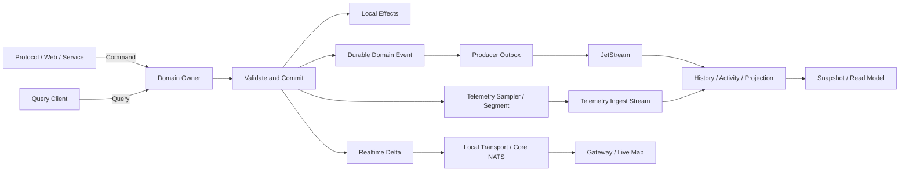
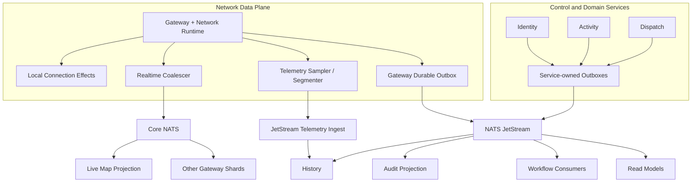

# RFC-0005：Event Model and Delivery Semantics

| 字段 | 内容 |
| --- | --- |
| 状态 | Proposed |
| 日期 | 2026-08-17 |
| 负责产品组 | AsterFSD Platform |
| 影响范围 | Command、Query、Effect、Realtime Delta、Domain Event、Telemetry Segment、Snapshot、Outbox、Core NATS、JetStream、History、Projection |
| 上位 RFC | [RFC-0001](0001-asterfsd-platform-architecture.md)、[RFC-0002](0002-technology-stack-and-infrastructure-profiles.md)、[RFC-0003](0003-identity-and-trust-architecture.md)、[RFC-0004](0004-network-runtime-sharding-and-high-availability.md) |
| 相关 RFC | [RFC-0006：History, Replay and Telemetry Architecture](0006-history-replay-and-telemetry-architecture.md)、[RFC-0007：Activity and Dispatch Integration](0007-activity-and-dispatch-integration.md) |
| 核心原则 | 意图与事实分离、按业务键有序、至少一次与幂等、有界背压、schema 可演进、热路径隔离 |

## 1. 摘要

AsterFSD Platform 需要同时服务 classic/VATSIM/Aster Gateway、Identity、History、Live Map、Activity、Dispatch、Weather、AIRAC 和 Web Control Plane。它们共享业务事实，但不共享数据库，也不通过一个万能消息结构互相调用。

本 RFC 固定以下六类消息契约：

1. `Command` 表达调用方希望系统执行的意图，有明确 owner、deadline、幂等键和结果。
2. `Query` 表达读取请求，不改变业务状态，使用 Tonic gRPC、Axum HTTP 或进程内 typed service。
3. `Effect` 表达单个 owner 在一次状态转换后需要执行的本地动作，不作为跨服务公共事实。
4. `RealtimeDelta` 表达可过期、可合并、低延迟的当前状态变化，Standalone 使用进程内有界 transport，Distributed/Kubernetes 使用 Core NATS。
5. `DomainEvent` 表达已经提交、需要审计或投影的不可变业务事实，先进入 producer-owned durable outbox，再通过 JetStream 以 at-least-once 语义交付。
6. `TelemetrySegment` 表达已经采样、分段和压缩的 durable data-plane 记录，通过独立短保留 telemetry stream 交给 History ingest。

`Snapshot` 是第七种独立恢复产物。它描述某一版本的当前状态，不代表一个新的业务事实，也不替代 History。



核心消息语义：

- Core NATS 是 at-most-once realtime transport；旧 delta 可以被新状态覆盖。
- JetStream 是 durable delivery transport；domain event stream 与 telemetry ingest stream 分离治理，业务正确性仍按 at-least-once、幂等、version 和 fencing 设计。
- 不建立跨 PostgreSQL、SQLite、JetStream 和 Network Runtime 内存状态的分布式事务。
- durable mutation 在 producer-owned transaction 内同时提交业务状态与 outbox record。
- position、visibility 和短时 presence delta 不等待数据库或 JetStream acknowledgement。
- flight plan、handoff、activity、Identity membership/rating/suspension mutation 在 durable outbox 接受后才返回成功。
- session disconnect 永远先释放权威连接状态；durability 故障记录为明确的审计缺口，不阻塞 socket cleanup。
- 所有 transport、outbox、mailbox、replay 和 quarantine 都有容量、最大 age、重试和告警上限。

## 2. 目标

本 RFC 的目标是：

- 给所有 AsterFSD 模块一套稳定的 command/event 语言；
- 防止协议 backend、History、Web、Dispatch 和 Activity 各自复制领域 DTO；
- 区分实时可丢数据与 durable 业务事实；
- 固定跨服务消息的 network scope、身份、版本、顺序和安全字段；
- 固定 producer、transport、consumer 各自承担的可靠性责任；
- 支持 Standalone、Distributed 和 Kubernetes Profile 使用同一领域语义；
- 支持 schema rolling upgrade、旧事件 replay 和 projection rebuild；
- 为未来多 Network、区域 shard、边缘节点和第三方 integration 保留清晰边界；
- 保持 position 热路径无同步数据库、Identity、Directory、History 或 JetStream ack；
- 让故障、背压、重复、乱序、gap 和 unknown commit outcome 有可测试结果。

## 3. 非目标

本 RFC 不定义：

- classic、VATSIM 或 Aster 的 wire frame；
- 具体 History 表、ClickHouse 表或 Parquet layout；
- ATC handoff 的完整业务状态机；
- Activity、Dispatch、Weather、AIRAC 的全部产品字段；
- NATS Helm values、storage class 和节点规格；
- public Web API 的完整 OpenAPI surface；
- 通过 broker 实现任意 RPC；
- 一个覆盖所有服务的全局事务；
- 整个 Network 的全局全序日志。

## 4. 术语

### 4.1 Command

Command 是对唯一 owner 的状态变更请求：

```text
FileFlightPlan
AcceptHandoff
SuspendMembership
JoinActivity
UpdateNetworkPolicy
```

Command 具有：

- 明确 target service/aggregate；
- authenticated actor 或 service principal；
- `NetworkId` 或明确的 global scope；
- deadline；
- request/correlation id；
- 适用时的 idempotency key；
- expected version 或 fencing token；
- typed success/error result。

Command 仍可能失败。收到 command 不代表业务状态已经提交。

### 4.2 Query

Query 是无业务副作用的读取请求：

```text
GetCurrentFlightPlan
ResolveNetworkProfile
ListActivityParticipants
GetReplaySegment
```

Query 默认使用：

- 同进程 typed service；
- Tonic gRPC；
- Axum HTTP；
- 受控 server-streaming。

NATS subject 不作为默认 Query/RPC API。请求结果、权限错误、deadline 和取消语义应由 gRPC/HTTP contract 明确表达。

### 4.3 Effect

Effect 是 domain owner 完成一次 command 后交给本地 runtime 的动作：

```text
DeliverToConnection
CloseConnection
PublishRealtime
AppendDurableEvent
ScheduleRefresh
```

Effect 与 DomainEvent 的区别：

- Effect 可以是执行计划，尚未发生；
- DomainEvent 是已经提交的事实；
- Effect 可以包含本地 `ConnectionId`；
- DomainEvent 使用稳定跨进程 ID；
- Effect 不直接成为 public integration contract。

### 4.4 RealtimeDelta

RealtimeDelta 描述当前状态的最新变化，消费者允许通过 snapshot/current-state query 修复 gap：

```text
PilotPositionDelta
AtcPositionDelta
PresenceDelta
VisibilityDelta
WindDelta
MapOccupancyDelta
```

它具有低延迟、短生命周期、可合并和 at-most-once 特征。

### 4.5 DomainEvent

DomainEvent 是 owner 已经提交的不可变业务事实：

```text
SessionStarted
SessionEnded
FlightPlanFiled
FlightPlanAmended
HandoffAccepted
MembershipSuspended
ActivityJoined
```

它用于：

- History ingest；
- projection rebuild；
- audit；
- 下游 workflow；
- cache invalidation；
- integration notification。

事件名使用过去式，不使用 `CreateX`、`UpdateX` 这种 command 命名。

### 4.6 TelemetrySegment

TelemetrySegment 是从高频 data-plane 状态中采样、分段和压缩出的 durable ingest artifact：

```text
TrackChunk
WeatherObservationBatch
NetworkQualitySegment
```

它与 DomainEvent 的区别：

- 它描述一段观测数据，不声明业务状态转换；
- 它使用 segment id/sequence/checksum 幂等，不使用 aggregate event version 表达业务因果；
- 它进入独立短保留 ingest stream，History 持久化后即可 ack；
- 它允许明确的采样、gap 和 compaction policy；
- 它不把每个原始 packet 变成 durable message。

TelemetrySegment 的具体 track、retention 和 replay contract 由 [RFC-0006](0006-history-replay-and-telemetry-architecture.md) 固定。

### 4.7 Snapshot

Snapshot 是一个 owner 在某个 version/checkpoint 的当前状态镜像：

```text
NetworkRuntimeSnapshot
FlightPlanSnapshot
ActivitySnapshot
ProjectionCheckpoint
```

Snapshot 用于快速恢复或 gap reconciliation。它不替代事件历史，也不因为写入成功而产生一个新的业务动作。

## 5. 总体架构



所有权边界：

| 组件 | 拥有 | 不拥有 |
| --- | --- | --- |
| Domain owner | command 校验、业务事务、event payload | broker retention、consumer checkpoint |
| Local runtime | effect 执行、bounded queue、coalescing | durable 业务事实的最终存储 |
| Outbox publisher | publish/retry/ack/mark-sent | 业务状态修改 |
| Core NATS | realtime subject routing | durable replay、业务事务 |
| JetStream | durable message storage/delivery | consumer 业务幂等 |
| Telemetry segmenter | sampling、chunk、sequence、checksum、bounded spool | History query、业务事件 |
| Consumer | projection、checkpoint、业务 side effect | producer 业务状态 |
| History | 查询、track、replay materialization | Gateway session authority |

## 6. Rust 所有权和 crate 边界

现有项目契约继续有效：

- `aster_fsd_model` 拥有协议无关的 command、effect、event payload 和强类型 ID；
- `aster_fsd_core` 拥有 Network Runtime 状态转换；
- `aster_fsd_server` 执行 connection effect 和有界 transport；
- protocol backend 只映射 wire 与 model；
- persistence adapter 拥有业务 repository/outbox transaction；
- NATS/JetStream adapter 位于 integration/composition 边界，不进入 core；
- Protobuf schema 位于稳定的 contract package，不从 SeaORM entity 自动生成。

公共 Rust 类型按语义拆分：

```text
aster_fsd_model
├── command
├── effect
├── realtime
├── event
│   ├── network
│   ├── identity
│   ├── coordination
│   └── activity
├── snapshot
└── identifiers
```

不建立一个持续膨胀的万能 `PlatformEvent`。共享 envelope，payload 按 bounded context 分组。热路径 event 保持具体、紧凑和 inline；不使用 `Box<dyn Event>` 隐藏大小、分配和 ownership 问题。

跨服务 Protobuf package 示例：

```text
aster.common.v1
aster.network.events.v1
aster.identity.events.v1
aster.activity.events.v1
aster.coordination.events.v1
aster.realtime.v1
```

生成代码只作为 transport DTO。domain model 与 Protobuf DTO 通过明确 conversion 和 validation 连接。

## 7. Command contract

跨服务 command metadata：

```text
CommandContext
├── request_id
├── correlation_id
├── causation_id
├── authority_id
├── network_id
├── actor_principal
├── idempotency_key
├── expected_version
├── deadline
└── trace_context
```

规则：

- `request_id` 标识一次 transport 调用；
- retry 使用同一 `idempotency_key`，不复用新的业务意图；
- `expected_version` 用于 optimistic concurrency；
- shard-owned command 额外带 `ShardEpoch`、claim version 或等价 fencing token；
- actor 使用稳定 principal reference，不复制完整 Identity profile；
- deadline 由入口设定并逐层收紧；
- command payload 设 byte/field/list 上限；
- sensitive field 在日志、event 和 error 中 redacted。

Command 的 owner 只有一个。多个服务共同决定一次 mutation 时，由一个 orchestration owner 调用其他 port，避免多个服务各自认为自己已经提交成功。

## 8. Realtime envelope

Canonical realtime envelope：

```text
RealtimeEnvelope<T>
├── schema_version
├── network_id
├── producer_service
├── shard_id
├── shard_epoch
├── source_sequence
├── entity_ref
├── entity_version
├── routing
├── occurred_at
├── expires_at
├── trace_context (optional sampled)
└── payload: T
```

字段语义：

- `source_sequence` 在 producer shard 内单调递增，用于检测 gap；
- `entity_version` 在同一 entity 内比较新旧；
- `expires_at` 防止网络分区后的旧位置重新污染当前状态；
- `routing` 是 typed intent，不携带 socket address 或协议 wire；
- `shard_epoch` 让 target 拒绝旧 producer；
- payload 不包含 password、token、credential hash 或未脱敏认证数据。

Realtime payload 的编码必须有最大尺寸。未知 schema version 进入 drop/metric 路径，不阻塞 subscriber loop。

## 9. Durable event envelope

Canonical durable envelope：

```text
DomainEventEnvelope<T>
├── event_id
├── event_type
├── schema_version
├── authority_id
├── network_id (optional only for global authority event)
├── aggregate_type
├── aggregate_id
├── aggregate_version
├── producer_service
├── producer_instance
├── shard_id/epoch (when shard-owned)
├── occurred_at
├── recorded_at
├── correlation_id
├── causation_id
├── actor_ref
├── authorization_version
├── data_classification
└── payload: T
```

必须满足：

- `event_id` 全局唯一且稳定；
- `event_type` 是稳定机器名，如 `network.flight_plan.amended`；
- `schema_version` 与 event type 共同解释 payload；
- `aggregate_version` 从 owner transaction 得出；
- `occurred_at` 表示业务事实发生时间；
- `recorded_at` 表示 owner 持久化时间；
- `actor_ref` 只保存最小审计引用；
- `authorization_version` 支持 consumer 判断 stale principal/policy；
- payload 经过 data classification 和 redaction。

事件不保存：

- password；
- app password；
- session ticket；
- access/refresh token；
- service private key；
- credential hash；
- 完整登录 wire frame；
- ORM entity dump；
- 未经上限约束的任意 JSON。

## 10. ID、时间和版本

### 10.1 ID

使用不同强类型 ID：

```text
EventId
CommandId / RequestId
CorrelationId
AuthorityId
OrganizationId
NetworkId
MembershipId
ConnectionRef
FlightPlanId
HandoffId
ActivityId
```

不使用裸字符串在不同领域间互换，也不把 callsign 当作 Account/Membership 的永久身份。

### 10.2 时间

- transport 使用 UTC；
- wire/storage 精度固定并测试；
- consumer 不用本地 wall clock 判断 aggregate version；
- expiry 使用 producer timestamp 加 policy，并结合 receive time 防止异常时钟；
- outbox ordering 依赖数据库 sequence/version，不依赖 timestamp 排序。

### 10.3 Version

三个 version 分别治理：

| Version | 作用 |
| --- | --- |
| `schema_version` | payload 编码与字段兼容 |
| `aggregate_version` | 同一业务实体的提交顺序 |
| `shard_epoch` | 当前 shard 写入资格 |

三者不可互相替代。

## 11. 事件命名和 schema 演进

事件机器名遵循：

```text
<bounded_context>.<aggregate>.<past_tense_fact>
```

示例：

```text
network.session.started
network.session.ended
network.flight_plan.filed
network.flight_plan.amended
coordination.handoff.accepted
identity.membership.suspended
activity.participant.joined
```

兼容规则：

- 同一 major schema 内允许新增 optional field；
- 不改变已有字段的单位、含义和枚举值；
- 不复用已删除 field number；
- breaking payload 建立新 schema major 或新 event type；
- producer rolling upgrade 期间可以同时发布兼容版本，但必须有删除条件和期限；
- consumer 声明支持的最小/最大 schema version；
- unknown optional field 保留 Protobuf forward compatibility；
- unknown enum 使用显式 `UNSPECIFIED/UNKNOWN`，不映射成有效业务状态；
- replay runner 必须覆盖所有仍在 retention 内的 schema version。

Event type 不因为新增一个 consumer 而变化。`HistoryFlightPlanUpdated` 和 `MapFlightPlanUpdated` 这类 consumer-specific 事件名称不进入 canonical model。

## 12. Subject taxonomy

Subject 只负责粗粒度路由，不承载完整权限或业务判断。

建议 subject：

```text
aster.network.<network_token>.rt.shard.<shard_id>.direct
aster.network.<network_token>.rt.position.<spatial_cell>
aster.network.<network_token>.rt.presence.<audience>

aster.network.<network_token>.event.session
aster.network.<network_token>.event.flight_plan
aster.network.<network_token>.event.handoff
aster.network.<network_token>.event.activity

aster.identity.<authority_token>.event.membership
aster.navdata.event.airac
```

约束：

- `<network_token>` 是规范化、不可枚举敏感信息的 subject token；
- raw email、callsign、password、token 和用户输入不进入 subject；
- shard credential 只 publish/subscribe 自己 Network 的允许前缀；
- direct subject 只路由到 target shard，payload 仍校验 NetworkId、target、epoch 和 claim；
- subject version 保持稀疏，schema version 主要位于 envelope；
- wildcard 权限以最小范围配置；
- public integration 使用独立 account/credential 和 allowlist subject；
- NATS monitoring endpoint 只对内部运维网络开放。

## 13. Core NATS realtime 语义

Core NATS realtime delivery 是 at-most-once：

- publisher 不等待每个 subscriber ack；
- subscriber disconnect 期间 delta 可能缺失；
- consumer 使用 sequence/version 检测 gap；
- gap 通过 current-state query 或 snapshot 修复；
- position、visibility 等可按 entity coalesce；
- queue 满时优先保留最新值；
- expired delta 直接丢弃并计数；
- direct control message 不与 position 共用可丢策略。

### 13.1 Position delta

```text
decode packet
  -> validate source/session
  -> update local authoritative position
  -> local recipient effects
  -> update coalescer slot(entity)
  -> non-blocking publish latest delta
```

每个 entity 在 coalescer 中最多保留一个待发送最新值。高频更新覆盖旧值，不产生无界队列。

### 13.2 Presence delta

Presence realtime delta 用于快速地图和 peer shard 更新。权威 session lifecycle 仍由 durable event/snapshot 修复，因此 realtime presence gap 不会永久制造 ghost session。

### 13.3 Direct inter-shard delivery

Direct delivery 使用 target shard subject，但 target 必须重新校验：

- NetworkId；
- target `ConnectionRef`/callsign claim；
- source shard epoch；
- source principal/capability；
- event expiry；
- payload size/schema。

## 14. JetStream durable 语义

JetStream 提供：

- durable storage；
- publish acknowledgement；
- consumer acknowledgement；
- redelivery；
- replay；
- retention 和 replication。

AsterFSD 的业务语义仍然是：

```text
producer: at-least-once publish
broker: at-least-once delivery
consumer: idempotent apply
business result: exactly-once observable effect where required
```

最后一行由应用的 unique constraint、version、CAS、fencing 和 inbox/checkpoint 实现，不由 broker marketing claim 实现。

### 14.1 Stream 边界

推荐按 retention、security 和 failure ownership 划分 stream，而不是每个 event type 一个 stream：

```text
ASTER_NETWORK_EVENTS
ASTER_IDENTITY_EVENTS
ASTER_ACTIVITY_EVENTS
ASTER_NAVDATA_EVENTS
ASTER_TELEMETRY_INGEST
```

每个 stream 明确：

- subject set；
- retention policy；
- max age/bytes/messages；
- replication；
- storage；
- duplicate window；
- discard policy；
- backup/restore；
- schema compatibility window。

### 14.2 Consumer

每个 durable consumer 使用稳定 durable name，并拥有：

- filter subject；
- explicit ack；
- ack wait；
- max delivery；
- backoff；
- max ack pending；
- dead-letter/quarantine policy；
- replay/start position；
- checkpoint/inbox transaction。

## 15. Producer outbox

### 15.1 原子边界

数据库 owner 的 mutation：

```text
BEGIN
  validate expected version
  update owner state
  insert audit record
  insert outbox(event envelope)
COMMIT
```

publisher：

```text
claim pending rows with lease
  -> publish to JetStream using event_id/message-id
  -> receive ack
  -> mark published
```

数据库 commit 后 publisher crash 会产生重复 publish，consumer 通过 `event_id` 幂等处理。

### 15.2 Runtime-owned durable event

Network Runtime 的 active state 位于内存，但 session、flight plan 和 handoff lifecycle 仍需要 durable record。官方实现提供 bounded local durable outbox：

- Standalone 使用 SQLite owner schema；
- Distributed/Kubernetes 默认使用 PostgreSQL owner schema；
- local durable spool 只作为显式 storage adapter，必须使用持久 volume、checksum、epoch fencing 和同等恢复测试；
- append 在 control path 执行，不进入每个 position packet；
- outbox record 包含完整 envelope、checksum、state、attempt、lease 和 timestamps；
- record size、total bytes 和 max age 有上限；
- crash recovery 先验证 checksum/schema，再恢复 publisher；
- old shard epoch 的 unpublished record 经 fencing policy 处理，旧 owner 不得发布成当前事实。

### 15.3 Runtime journal commit point

Network Runtime 的 durable command 使用 journal/outbox record 作为提交点：

```text
receive command + idempotency key
  -> validate session/claim/expected version
  -> construct next aggregate version and deterministic result
  -> append runtime journal/outbox record
  -> apply committed record to in-memory state
  -> emit local effects/realtime delta
  -> return stored command result
```

语义：

- append 前失败：command 尚未提交；
- append 成功、内存 apply 前 crash：恢复时按 journal version 重放；
- apply 成功、response 前 crash：调用方使用同一 idempotency key 重试并获得已存结果；
- event publish 前 crash：outbox publisher 恢复后继续发布；
- old shard epoch 的 journal record 只用于恢复/审计，不授予旧 shard 当前写权限；
- same aggregate version/different payload 是完整性事故。

登录跨越 Identity、Directory claim、runtime journal 和 TCP response，顺序固定为：

```text
authenticate
  -> claim callsign with ShardEpoch
  -> append SessionStarted journal/outbox record
  -> transition local session to Active
  -> publish presence/lifecycle
  -> send protocol success/welcome
```

如果 journal append 失败，Gateway 释放刚取得的 callsign claim 并关闭 admission。若 shard 在 journal commit 后、客户端收到成功前 crash，该 session 仍被记录为一次极短生命周期；shard fencing/reconciliation 负责关闭该 epoch 的遗留 session，调用方重连后获得新的 `ConnectionRef`。

disconnect 使用不同优先级：

```text
remove local session/callsign/principal indexes
  -> stop delivery and close socket
  -> release Directory claim idempotently
  -> append/publish SessionEnded
```

连接 ownership 的释放不等待 durable dependency。`SessionEnded` append 失败进入 bounded emergency journal/重试并触发 durability breach；History 还可通过 shard-fenced lifecycle、lease expiry 和 snapshot reconciliation 关闭遗留 session。

### 15.4 Operation durability class

| 操作 | 成功边界 | Transport 故障行为 |
| --- | --- | --- |
| Position/visibility delta | 权威内存状态已更新 | 合并、过期或丢弃旧 delta |
| Presence realtime | session state 已更新 | snapshot/lifecycle event 修复 |
| Login/session started | callsign claim、session active、durable outbox accepted | outbox 满时停止新 admission |
| Disconnect/session ended | 本地索引释放优先 | append/retry；失败产生 durability breach |
| Flight plan mutation | owner state 与 outbox 原子接受 | 返回依赖不可用/容量错误 |
| Handoff mutation | coordination state 与 outbox 原子接受 | 不报告虚假成功 |
| Activity mutation | Activity owner transaction 与 outbox 提交 | 不报告虚假成功 |
| Identity/rating/suspension | Identity transaction、audit 与 outbox 提交 | fail closed |
| Chat/private message | realtime delivery；归档按 Network policy | 默认不形成强 durable mutation |

### 15.5 Outbox capacity

Outbox 配置：

```text
max_records
max_bytes
max_record_bytes
max_age
claim_batch
lease_duration
retry_backoff
publish_timeout
```

容量耗尽时按 durability class 执行：

- realtime telemetry 合并或丢弃；
- 新登录进入 admission backpressure；
- durable control mutation 返回明确依赖/容量错误；
- disconnect cleanup 继续并记录高优先级审计缺口；
- readiness 变为 degraded/false；
- 不无限增长磁盘文件。

## 16. Consumer idempotency

Consumer transaction 推荐：

```text
BEGIN
  insert inbox(event_id) on conflict do nothing
  if duplicate: COMMIT and ack
  validate aggregate_version/fencing
  apply projection or side effect
  update checkpoint
COMMIT
ack JetStream message
```

规则：

- ack 在 consumer transaction 成功后；
- ack 丢失导致 redelivery，inbox 去重；
- duplicate 不重复发邮件、扣配额、创建 activity 或写 track；
- stale aggregate version 不覆盖新 projection；
- gap 触发暂停该 aggregate、snapshot/query reconcile 或受控 replay；
- poison event 经过有限重试进入 quarantine，不永久阻塞整个 stream；
- quarantine 保留 event id、type、schema、error class 和 redacted diagnostics。

只读 projection 也需要幂等。覆盖写并不自动等于正确，旧事件仍可能覆盖新值。

## 17. 顺序模型

AsterFSD 不建立全 Network 全序。保证层级：

1. 同一个 producer shard 的 `source_sequence` 可观测有序。
2. 同一 aggregate 的 durable mutation 通过 `aggregate_version` 有序。
3. 同一 connection 的 wire delivery 由 bounded mailbox/single writer 保序。
4. 不同 aggregate、shard、service 之间允许并发和交错。

示例：

```text
FlightPlan(ECP4143) version 40 -> 41 -> 42
Handoff(H123) version 7 -> 8

两条 aggregate 序列彼此没有全局先后承诺。
```

Consumer 遇到：

- `version == current + 1`：应用；
- `version <= current`：duplicate/stale，幂等跳过；
- `version > current + 1`：gap，进入 reconcile；
- shard event 的 old epoch：fenced reject；
- same version different payload：integrity incident。

## 18. Correlation、causation 和 workflow

一次跨服务流程使用：

```text
correlation_id: 整个业务流程
causation_id: 直接触发当前 command/event 的上一步
event_id/request_id: 当前消息
```

示例：

```text
Web AcceptHandoff command
  correlation = C1
  request = R1

HandoffAccepted event
  event = E1
  correlation = C1
  causation = R1

Activity projection update
  correlation = C1
  causation = E1
```

Workflow 不把 tracing span id 当作业务幂等键。trace sampling 或 backend 变化不应改变业务正确性。

## 19. Snapshot、replay 和 reconciliation

### 19.1 Snapshot contract

Snapshot metadata：

```text
SnapshotEnvelope<T>
├── snapshot_id
├── schema_version
├── authority_id/network_id
├── owner/aggregate
├── owner_version
├── shard_id/epoch when applicable
├── created_at
├── event_checkpoint
├── checksum
└── payload
```

Snapshot 必须：

- 使用稳定 schema；
- 带 checksum；
- 带 owner version/checkpoint；
- credential redacted；
- 有 size/age/retention 上限；
- 在恢复时经过 schema、network、epoch 和完整性校验。

### 19.2 Replay

Replay runner：

```text
select snapshot/checkpoint
  -> create isolated projection generation
  -> replay durable events in aggregate order
  -> validate counts/checksums/invariants
  -> atomically switch read model generation
```

不在生产 read model 上边清空边重放。projection rebuild 使用新 generation，验证成功后切换。

### 19.3 Realtime gap

Realtime subscriber 检测到 sequence gap：

```text
mark source/entity stale
  -> request bounded current-state snapshot
  -> compare entity version
  -> apply fresh state
  -> resume deltas
```

位置 gap 不触发从 JetStream 重放每个 position packet。

## 20. History、Live Map、Activity 和 Dispatch

### 20.1 History

History 消费 durable lifecycle event 和经过 Gateway sampler/segmenter 生成的 durable telemetry segment：

- session timeline；
- flight plan versions；
- handoff timeline；
- activity participation；
- compressed position track；
- replay materialization。

Live Map 继续直接消费 realtime delta。History ingest 不从 Core NATS 的 at-most-once position subject 猜测完整轨迹。

History 不成为 Network Runtime 写路径依赖，也不读取 Identity credential 表。

### 20.2 Live Map

Live Map：

- 订阅 realtime position/presence；
- 使用 snapshot 修复 gap；
- 订阅 durable lifecycle 修复 ghost entity；
- 对 WebSocket/SSE 客户端执行自己的 bounded fan-out；
- 地图故障不反压 Gateway connection mailbox。

### 20.3 Activity

Activity 是 participation、slot、规则和活动状态的 owner。它消费 Network event 形成关联，但不把“某 callsign 在线”直接当成持久报名事实。

### 20.4 Dispatch

Dispatch 通过 gRPC command/query 和 durable event integration 工作。它不直接订阅并修改 Gateway 内存，也不通过共享数据库 join flight plan/session state。

## 21. 安全与隐私

### 21.1 Authorization

- publish/subscribe 使用 service identity；
- NATS account/subject permission 限制粗粒度范围；
- payload 再校验 AuthorityId、NetworkId、actor、target 和 capability；
- consumer 不因为能订阅 subject 就获得所有 payload 字段的业务权限；
- public integration 通过独立 redacted event contract。

### 21.2 Data classification

建议 classification：

```text
Public
NetworkInternal
OperationalSensitive
PersonalData
SecuritySensitive
```

每种 event type 明确：

- classification；
- allowed consumers；
- retention；
- log policy；
- export policy；
- deletion/anonymization policy。

`SecuritySensitive` credential material 不进入 event backbone。

### 21.3 Multi-Network isolation

- event envelope 强制 NetworkId；
- subject permission 按 Network scope；
- consumer checkpoint 按 Network partition；
- cache key、inbox unique key 和 aggregate key 包含 NetworkId；
- replay/export 每次验证 Network authorization；
- 一个 Network 的 event 不进入另一个 Network 的 projection。

## 22. 背压和故障矩阵

| 故障 | Producer | Transport | Consumer/Projection |
| --- | --- | --- | --- |
| Core NATS down | 本地状态继续；delta coalesce/drop | realtime gap | snapshot reconcile |
| JetStream down | durable event 留在 bounded outbox | publish unavailable | 保持旧 projection 并报告 lag |
| Outbox full | 按 durability class backpressure | 无新增 durable publish | 不伪造成功 |
| Consumer slow | producer 不等待 | JetStream retention/lag 增长 | bounded ack pending，扩容或暂停 |
| Consumer crash before commit | 无影响 | redelivery | 重新处理 |
| Consumer crash after commit before ack | 无影响 | redelivery | inbox 去重 |
| Duplicate publish | 无影响 | duplicate/redelivery | event id 去重 |
| Out-of-order | version 不变 | transport 可交错 | aggregate version 校验 |
| Poison event | producer已提交 | 有限 redelivery | quarantine + alert |
| Old shard returns | epoch fenced | subject/payload校验 | old epoch reject |
| Snapshot corrupt | runtime 不采用 | 无影响 | fallback 旧 snapshot/replay |

所有 retry 都有 budget 和 backoff。永久错误不进入无限 retry loop。

## 23. 可观测性

### 23.1 Tracing

结构化字段：

```text
network_id
authority_id
event_type
schema_version
producer_service
shard_id
shard_epoch
aggregate_type
aggregate_version
subject
transport
result
error_class
queue_depth
queue_age
publish_elapsed
consumer_elapsed
redelivery_count
```

`event_id`、callsign、ConnectionRef 等高基数字段只进入受控 tracing/log，不作为常规 Prometheus label。

日志不输出完整 event payload。登录、Identity、private message 和 personal data 只记录 redacted metadata。

### 23.2 Metrics

至少包含：

- realtime publish/drop/coalesce/expired；
- source sequence gap；
- durable publish ack/error/timeout；
- outbox depth/bytes/oldest age/retry；
- JetStream consumer lag/redelivery/ack pending；
- inbox duplicate/stale/gap；
- quarantine count；
- snapshot age/size/checksum failure；
- replay throughput/lag/error；
- stale epoch rejection；
- durability breach count。

### 23.3 Health

- liveness：进程/event loop 活着；
- readiness：关键 owner dependency、outbox capacity 和 schema compatibility 可接受；
- degraded：realtime transport down、projection lag 或非关键 consumer lag；
- fenced：ShardEpoch/Directory lease 失效，Network Runtime 停止 ownership 行为。

## 24. 性能和分配约束

Realtime 热路径：

```text
decode
  -> validate
  -> mutate local state
  -> build compact typed delta
  -> update bounded coalescer
  -> return
```

约束：

- position packet 不等待 JetStream ack；
- 不按 subscriber clone 完整 payload；
- encoded transport buffer 使用 `Bytes`/共享引用；
- coalescer key 使用强类型 entity/cell key；
- event envelope 预估并限制 encoded bytes；
- serialization buffer 可复用但不得跨任务共享可变全局状态；
- 不为统一 trait 在每个 delta 上分配 `Box`；
- 不持有全局写锁跨 await；
- 不使用无界 MPSC；
- metrics 不按 event id/callsign 建 label；
- benchmark 报告 allocations/message、bytes/message、p50/p95/p99、drop/coalesce 和 queue age。

Durable control path 可以承担 outbox transaction，但必须设置 deadline、连接池上限和 admission concurrency。

## 25. 部署 Profile

### 25.1 Standalone

```text
asterfsd process
├── Network Runtime
├── bounded local realtime transport
├── SQLite durable outbox
├── embedded History/Projection consumers
└── no external NATS requirement
```

Local adapter 与 NATS adapter 实现相同 contract 和测试语义。Standalone 不是另一套 event model。

### 25.2 Distributed

```text
Gateway shards -> Core NATS
Service outboxes -> JetStream
Identity/Activity/Dispatch -> Tonic + durable events
History/Map -> independent consumers
PostgreSQL -> service-owned state/outbox/inbox
```

### 25.3 Kubernetes

在 Distributed 基础上要求：

- JetStream 奇数副本和持久 volume；
- PDB、anti-affinity 和 storage topology；
- NetworkPolicy 与 service credentials；
- stream/consumer declarative configuration；
- outbox/consumer lag rollout gate；
- drain 前停止 admission；
- schema compatibility preflight；
- backup/restore 和 replay rehearsal；
- Pod imageID、Service、EndpointSlice 和 broker health 验证。

## 26. 测试矩阵

### 26.1 Contract

- Protobuf encode/decode golden fixture；
- unknown optional field；
- unknown enum；
- max payload/list/string；
- required identifier validation；
- redaction；
- schema compatibility；
- old supported event replay。

### 26.2 Producer

- business commit + outbox atomicity；
- commit success/publish crash；
- publish ack lost；
- duplicate publish；
- outbox lease expiry/steal；
- max bytes/age/records；
- old shard epoch record；
- disk full/corrupt record；
- shutdown flush budget。

### 26.3 Realtime

- Core NATS disconnect/reconnect；
- coalescing 保留最新 position；
- expired delta；
- sequence gap；
- stale entity version；
- cross-Network subject isolation；
- slow subscriber；
- direct target epoch/claim validation；
- allocation benchmark。

### 26.4 Consumer

- duplicate；
- out-of-order；
- gap；
- commit before ack crash；
- poison event/quarantine；
- stale epoch；
- same version/different payload integrity incident；
- checkpoint restore；
- projection generation switch；
- idempotent external side effect。

### 26.5 Failure and operations

- JetStream outage；
- outbox full；
- consumer lag 超过 retention budget；
- stream restore；
- credential rotation；
- unauthorized subject；
- rolling producer/consumer schema upgrade；
- Kubernetes Pod eviction/drain；
- Network partition；
- clock skew；
- backup restore + full replay。

## 27. 排除方案

### 一个万能消息类型

排除原因：Command、Effect、RealtimeDelta、DomainEvent 和 Snapshot 的失败、顺序、持久性和权限语义不同。万能 DTO 会把这些差异隐藏在 optional field 和字符串 type 中。

### 所有服务共享数据库表

排除原因：破坏 owner、独立 migration、权限、故障隔离和部署边界。跨服务使用 contract/event。

### 所有调用都走 NATS request/reply

排除原因：Query/Command 的 deadline、typed error、streaming 和 authorization 由 Tonic/Axum 更清晰表达。NATS 保留 realtime/durable event backbone 职责。

### 所有 position 永久写入 JetStream

排除原因：高频 telemetry 与 durable lifecycle 的 retention、成本和恢复目标不同。position 走 realtime delta、采样和 track compaction。

### 依赖 broker exactly-once

排除原因：producer database、broker、consumer database 和外部 side effect 之间仍存在 failure window。应用继续使用 outbox、event id、inbox、version 和 fencing。

### 全 Network 全序

排除原因：吞吐、可用性和 shard 独立性成本过高。业务只需要 aggregate、connection 和 producer sequence 范围内的顺序。

### 内存无限 retry queue

排除原因：依赖故障会扩散为 OOM。所有 queue/spool 有容量和明确耗尽行为。

### 用 tracing id 作为业务身份

排除原因：trace 可采样、可缺失、会跨 backend 变化。业务使用稳定 event/request/correlation/idempotency ID。

### 用 JSON/ORM dump 作为长期 event schema

排除原因：缺少字段号、兼容治理、大小约束和安全边界。公共 contract 使用版本化 Protobuf 或同等级结构化 schema。

## 28. 实施约束

本 RFC 固定最终消息边界：

- Command、Query、Effect、RealtimeDelta、DomainEvent、TelemetrySegment、Snapshot 使用不同类型；
- domain owner 产生事实，transport 不产生业务事实；
- durable mutation 与 producer outbox 在 owner transaction 中绑定；
- consumer 使用 inbox/checkpoint/version/fencing；
- Core NATS 只承载可修复 realtime；
- JetStream 承载 durable event；
- 独立短保留 JetStream telemetry stream 承载已采样、分段和压缩的 ingest artifact；
- Standalone 使用 local adapter，不启动隐藏 broker；
- NATS adapter 不进入 `aster_fsd_core`；
- protocol backend 不发布 platform event；
- History/Map 不写 Network Runtime 权威状态；
- position 不等待数据库或 broker ack；
- schema、subject、retention、permission 和 replay 进入正式 contract/test；
- credential 不进入消息 backbone；
- 热路径不引入 `Box`、无界 channel、全局 await lock 或每 subscriber payload clone；
- 旧字符串 event bus、ORM dump 和 consumer-specific event 一次迁移并删除，不保留双轨 facade。

## 29. 完成标准

RFC 落地必须证明：

1. Command、Query、Effect、RealtimeDelta、DomainEvent、TelemetrySegment 和 Snapshot 在类型与 transport 上分离。
2. Standalone local adapter 与 Core NATS/JetStream adapter 通过同一 contract suite。
3. position 热路径不等待 Directory、Identity、History、database 或 JetStream ack。
4. durable mutation 与 outbox 原子提交，publish crash/ack lost 只产生幂等 duplicate。
5. consumer 在 duplicate、乱序、gap、redelivery 和 crash 中保持正确。
6. `NetworkId`、aggregate version 和 shard epoch 在跨服务边界强制校验。
7. old epoch、stale version 和 same-version/different-payload 有明确拒绝和审计结果。
8. schema rolling upgrade 和 retention 内旧事件 replay 通过。
9. subject permission 与 payload authorization 双重隔离多个 Network。
10. outbox、queue、coalescer、ack pending 和 quarantine 有界。
11. credential、完整登录 payload 和敏感 Identity 数据不进入 event、snapshot 或日志。
12. History、Live Map、Activity 和 Dispatch 只通过正式 contract/event 集成。
13. JetStream/Core NATS/consumer outage 不无界扩散到 Gateway packet 热路径。
14. allocation、latency、queue age、drop/coalesce、consumer lag 和 replay throughput 有 p50/p95/p99 证据。
15. README、config example、developer docs、schema registry、测试和 changelog 与实现同步。

## 30. 后续 ADR/RFC

- Protobuf common envelope 与 package/version policy；
- canonical NATS subject token 和 permission template；
- JetStream stream/consumer/retention/replication baseline；
- SQLite/PostgreSQL outbox/inbox schema 与 lease algorithm；
- realtime position spatial cell/coalescing contract；
- [RFC-0006](0006-history-replay-and-telemetry-architecture.md) 固定的 History ingest、track sampling、compression、retention 和 replay consistency；
- public integration event catalog 与 data classification；
- schema registry/compatibility CI；
- [RFC-0007](0007-activity-and-dispatch-integration.md) Activity and Dispatch Integration；
- RFC-0009 ATC Coordination and Handoff State Machine。

这些 ADR 可以细化字段、subject、参数和存储实现，但不得重新合并消息类别、共享数据库、让 position 同步等待 durable transport，或把 broker delivery claim 当作业务幂等替代品。
