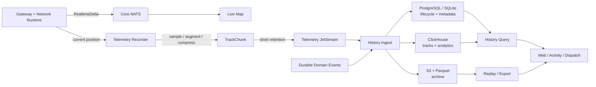
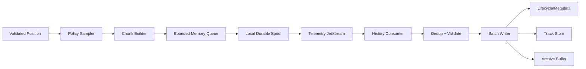

# RFC-0006：History, Replay and Telemetry Architecture

| 字段 | 内容 |
| --- | --- |
| 状态 | Proposed |
| 日期 | 2026-08-17 |
| 负责产品组 | AsterFSD Platform |
| 影响范围 | History、Telemetry Recorder、TrackChunk、Replay、PostgreSQL、ClickHouse、S3/Parquet、retention、privacy、ingest、query、projection |
| 上位 RFC | [RFC-0001](0001-asterfsd-platform-architecture.md)、[RFC-0002](0002-technology-stack-and-infrastructure-profiles.md)、[RFC-0005](0005-event-model-and-delivery-semantics.md) |
| 相关 RFC | [RFC-0003](0003-identity-and-trust-architecture.md)、[RFC-0004](0004-network-runtime-sharding-and-high-availability.md)、[RFC-0007](0007-activity-and-dispatch-integration.md) |
| 核心原则 | 当前状态与历史记录分离、实时地图与轨迹记录分离、采样而非原始 packet 永久化、可验证 gap、可重放、按 Network 隔离、存储可替换 |

## 1. 摘要

History 是 AsterFSD 的历史数据平面。它保存已经发生的 session、flight plan、handoff、activity 和身份审计事实，接收经过采样、分段和压缩的飞行轨迹，并为 Web、Live Map、Activity、Dispatch、回放和统计提供查询与导出能力。

History 不是 Network Runtime 的当前状态数据库，也不是 Gateway 的同步依赖：

```text
Network Runtime
  -> current session / callsign / position / flight plan authority

History
  -> past facts / sampled tracks / replay / query projections

Live Map
  -> current realtime view from Core NATS + snapshot reconciliation
```

本 RFC 固定的最优路径：

1. Gateway/Network Runtime 更新当前 position 后，将最新值交给本地异步 `TelemetryRecorder`。
2. Recorder 根据 Network policy 自适应采样，形成有界 `TrackChunk`。
3. `TrackChunk` 进入独立的短保留 JetStream telemetry ingest stream；Standalone 使用本地 bounded spool/consumer。
4. History Ingest 以 at-least-once 语义消费，使用 `(NetworkId, TrackId, SegmentSequence, Checksum)` 幂等写入。
5. 小型部署使用 SQLite/PostgreSQL，紧凑分布式部署使用 PostgreSQL，大型部署使用 ClickHouse；长期归档统一使用 S3/Parquet。
6. Domain Event 保存业务事实，TrackChunk 保存采样观测，两者分开查询、保留和重放。
7. Replay 通过 manifest 固定 event checkpoint、track watermark、schema version、gap 和数据 generation，避免拼出未经证明的“完整历史”。



## 2. 问题边界

只保留实时 position 会失去：

- 连飞结束后的轨迹；
- flight plan 版本变化；
- handoff timeline；
- 活动参与历史；
- 断线、重连和 shard fencing 造成的 gap 解释；
- 审计和合规所需的生命周期事实。

把每一个原始 FSD position packet 永久写入数据库又会造成：

- 写放大和索引膨胀；
- History 故障反向影响 Gateway；
- ClickHouse/Parquet 只收到 wire 级噪声；
- replay 成本随 packet 数线性增长；
- 多协议字段重复存储；
- 真实 gap 被重试逻辑掩盖。

因此 History 需要三条数据链：

```text
Lifecycle facts  -> Domain Event -> History event tables
Realtime view    -> Core NATS   -> Live Map projection
Flight track     -> TrackChunk  -> Telemetry ingest -> track store/archive
```

## 3. 数据分类与权威

| 数据类别 | 示例 | 当前权威 | History 形态 |
| --- | --- | --- | --- |
| Runtime state | active session、current position、current flight plan | Network Runtime shard | snapshot/reconciliation source |
| Lifecycle fact | SessionStarted、FlightPlanAmended、HandoffAccepted | domain owner + durable outbox | immutable event timeline |
| Realtime delta | position、visibility、presence | runtime event sequence | Live Map/cache input |
| Telemetry segment | TrackChunk、weather batch、network quality segment | recorder + segment sequence | compact track/analytics row |
| Read model | session timeline、activity view、track index | History projection | query-optimized projection |
| Archive object | Parquet track partition、export package | History archive writer | immutable object + manifest |

History 记录的当前快照带 `source_version` 和 `snapshot_at`，代表读取时的已知状态，不改变 Runtime authority。

## 4. History 服务边界

History 逻辑上由四个组件组成，可在 Standalone 中装配在同一进程，也可在 Distributed/Kubernetes 中独立部署：

```text
History
├── Ingest
│   ├── domain event consumer
│   ├── telemetry consumer
│   ├── inbox/idempotency
│   └── batch writer
├── Query
│   ├── timeline query
│   ├── track query
│   ├── bounded replay stream
│   └── access policy
├── Replay
│   ├── manifest
│   ├── projection generation
│   ├── gap handling
│   └── export/import
└── Archive
    ├── partition close
    ├── Parquet writer
    ├── checksum/manifest
    └── retention/deletion
```

History 拥有：

- lifecycle event projection；
- TrackChunk ingest、dedup 和 compaction；
- track/session/flight query；
- replay manifest 和 read-model generation；
- archive object、checksum 和 retention job；
- gap、quality、late-arrival 和 ingest lag 记录；
- History API 与导出权限。

History 不拥有：

- active TCP connection；
- callsign claim；
- 当前 session admission；
- Identity password、credential 或完整 profile；
- Protocol wire frame；
- Network Runtime 的 current position mutation；
- Dispatch 或 Activity 的业务规则。

## 5. Crate 和服务边界

建议的 workspace 方向：

```text
aster_fsd_model
      |
      +--> aster_fsd_history
      |      ├── HistoryId / TrackId / SegmentSequence
      |      ├── HistoryCommand / Query
      |      ├── TrackChunk model
      |      ├── ReplayManifest
      |      └── HistoryStore / ArchiveStore ports
      |
      +--> aster_fsd_history_persistence
             ├── SQLite/PostgreSQL adapter
             ├── ClickHouse batch adapter
             └── S3/Parquet archive adapter
```

约束：

- `aster_fsd_history` 不依赖 SeaORM entity 和具体数据库驱动；
- History model 不依赖 `async-nats`、`tonic` 或 Axum；
- persistence adapter 负责 SQL、ClickHouse insert、object storage 和 transaction；
- Tonic/Axum/NATS adapter 在 composition/service 边界；
- ClickHouse row model 与 domain event model 通过显式 mapping 连接；
- 不使用 ORM entity 直接生成长期 event/track schema；
- batch ingest 使用 SQLx 或数据库专用批量 API，避免逐 sample ORM insert。

## 6. Track 身份模型

### 6.1 SessionId、ConnectionRef 和 TrackId

```text
AccountId / MembershipId
  -> SessionId (一次 Network login 生命周期)
      -> ConnectionRef (一次 TCP 连接引用)
          -> TrackId (该 session 的轨迹序列)
```

- `ConnectionRef` 只用于在线 routing；
- `SessionId` 在 session lifecycle history 中稳定；
- `TrackId` 对一次有效 session 唯一；
- reconnect 创建新的 `SessionId`/`TrackId`，通过 `previous_session_id` 或 `journey_ref` 关联；
- callsign 不是轨迹永久主键；
- NetworkId 必须参与所有 ID、索引和 object key；
- TrackId 使用不可预测的 typed ID，避免从 URL 猜测别人的轨迹。

### 6.2 Track 关联

Flight plan 可能跨越 reconnect、callsign 变化或多个 session。History 使用明确的可选 `JourneyRef`/`FlightRef` 关联，而不是根据 callsign 和时间窗口猜测：

```text
FlightRef
├── network_id
├── stable flight reference
├── flight_plan version range
├── session/track members
└── confidence/source
```

自动关联只生成 `candidate`，需要明确规则或用户确认后升级为 authoritative link。

## 7. TrackChunk contract

### 7.1 Envelope

```text
TrackChunk
├── schema_version
├── network_id
├── track_id
├── session_id
├── segment_sequence
├── previous_segment_sequence
├── source_shard_id / source_shard_epoch
├── first_observed_at / last_observed_at
├── first_recorded_at / last_recorded_at
├── sample_count
├── sampling_policy_id
├── coordinate_reference
├── encoding
├── quality_flags
├── gap_before / gap_after
├── checksum
└── samples
```

幂等 key：

```text
(network_id, track_id, segment_sequence, checksum)
```

同一 `(network_id, track_id, segment_sequence)` 出现不同 checksum 视为 integrity incident，进入 quarantine 和告警。

### 7.2 Sample

```text
TrackSample
├── observed_at
├── latitude
├── longitude
├── altitude
├── groundspeed
├── heading
├── vertical_rate
├── transponder
├── position_source
├── source_sequence
└── quality
```

规则：

- 坐标、单位、精度在 schema 中固定；
- `observed_at` 与 `recorded_at` 分开；
- 缺失字段使用 explicit unknown，不使用魔法零；
- transponder `0000` 是有效业务值，禁止在历史层用 null/zero 混淆；
- 经纬度、海拔、速度和 heading 经过范围校验；
- source sequence gap 作为质量信息保存；
- recorder 生成的 sample 不伪造客户端未提供的导航数据。

### 7.3 Chunk size

默认边界建议：

```text
target_duration: 30s
hard_duration: 60s
max_samples: 512
max_uncompressed_bytes: 256 KiB
max_encoded_bytes: 128 KiB
```

达到任一 hard limit 即关闭当前 chunk。超大 payload 进入 reject/quarantine，不通过截断修复。

### 7.4 Encoding

Canonical contract 使用版本化 Protobuf payload；存储层可在 chunk 内使用：

- base timestamp + delta timestamp；
- fixed-point coordinate delta；
- altitude/speed/heading delta；
- bit-packed quality flags；
- zstd 或等价受控压缩。

压缩只优化存储和传输，查询层必须保留明确的 schema version、codec id、uncompressed bytes、compressed bytes 和 checksum。

## 8. Sampling policy

### 8.1 设计目标

采样策略同时满足：

- Live Map 仍获得完整 realtime delta；
- History 保存足够的轨迹形状；
- position packet 数量增长时存储成本有上限；
- 快速转弯、爬升、下降、速度变化和低空阶段保留更多点；
- 采样 gap 有明确原因；
- 每个 Network 可以按业务选择 policy。

### 8.2 默认 adaptive policy

建议默认参数：

```text
minimum_interval: 1s
target_interval: 5s
maximum_interval: 15s
turn_threshold: 10 degrees
altitude_threshold: 300 ft
speed_threshold: 20 kt
distance_threshold: 0.5 NM
```

采样触发条件满足任一项：

- 到达 target interval；
- 超过 distance/turn/altitude/speed threshold；
- 达到 maximum interval；
- session start/end；
- flight plan/handoff phase change；
- quality/source change；
- spatial cell change；
- operator policy 强制 anchor。

这些是默认值，不是客户端 wire contract。Network policy 可以收紧，但必须保持 minimum/maximum 上限和 recorder capacity 可证明。

### 8.3 Anchor sample

以下节点强制形成 anchor：

```text
session start
first valid position
flight plan association
handoff offer/accept/release
takeoff/landing heuristic transition
spatial cell boundary
session end
```

heuristic transition 要带 `source=derived` 和 confidence。派生状态不覆盖客户端原始字段。

### 8.4 Gap

Gap 明确记录：

```text
TelemetryGap
├── from_sequence / to_sequence
├── started_at / ended_at
├── reason
├── estimated_duration
└── recoverable
```

reason 示例：

- `core_nats_loss`；
- `recorder_backpressure`；
- `spool_full`；
- `history_outage`；
- `source_disconnect`；
- `invalid_sample`；
- `clock_anomaly`；
- `shard_fenced`。

渲染器可以视觉插值，查询结果必须保留 gap 标记，插值点不得伪装成 recorded sample。

## 9. Recorder 与 ingest pipeline



### 9.1 热路径边界

Network packet path 只执行：

```text
decode -> validate -> runtime state -> local delivery -> non-blocking recorder offer
```

Recorder offer：

- 使用 bounded channel；
- 不等待 History、JetStream ack 或数据库；
- 队列满时执行 sampling degradation/coalescing；
- 记录 drop/gap reason；
- 失败只影响 telemetry quality，不影响 packet dispatch。

### 9.2 Local spool

Local spool 是 recorder 与 transport 之间的有限恢复缓冲：

- Standalone 使用 SQLite/append-only segment；
- Distributed/Kubernetes 默认使用本地持久卷或 service-owned spool profile；
- 每条记录带 checksum、sequence、attempt、lease 和 creation time；
- spool 采用 oldest-first，但可按 priority 保留 session anchor；
- max bytes、max age、max segments 固定在 config；
- spool 满时先降采样，再记录 gap，最后进入 degraded；
- 旧 shard epoch 的 chunk 只在观测时间位于 fencing cutoff 之前、通过 provenance/checksum 校验且处于 bounded late-arrival window 时进入 History；
- spool recovery 经过 schema/checksum/Network/Track 校验。

### 9.3 Telemetry JetStream

Telemetry stream 与 domain event stream 分离：

```text
stream: ASTER_TELEMETRY_INGEST
retention: limits
max_age: bounded hours/days
ack: explicit
subject: aster.network.<network_token>.telemetry.track.<bucket>
```

它的职责是：

- 在 recorder 与 History ingest 之间提供短时 durable buffer；
- 跨 shard/History consumer 解耦；
- 支持 consumer crash/redelivery；
- 允许 History 恢复后按 chunk idempotency 追赶。

它不是长期 archive，也不是每个 raw position 的永久日志。chunk 成功写入 History 后，长期数据由 History/ClickHouse/S3 负责。

## 10. History ingest

### 10.1 Consumer flow

```text
receive TrackChunk
  -> validate envelope/schema/Network authorization
  -> verify checksum and size
  -> check inbox/segment key
  -> detect duplicate/stale/gap/conflict
  -> write batch to owner storage
  -> update ingest watermark
  -> commit
  -> ack message
```

ack 位于 storage transaction 成功之后。ack 丢失会 redelivery，segment key 保证幂等。

### 10.2 Batch writer

批量写入按以下维度聚合：

- NetworkId；
- storage backend；
- track partition；
- time window；
- schema/codec version。

每一批有：

- max records；
- max bytes；
- max wait；
- transaction deadline；
- retry budget。

单个坏 chunk 进入 quarantine，不能拖住整个 batch。完整性冲突升级为高优先级告警。

History ingest 维护 shard epoch timeline。`last_observed_at` 超过 fencing cutoff 的旧 epoch chunk 直接拒绝；cutoff 前的 late arrival 仍记录原始 epoch 和 ingest delay，避免旧 shard 在失去 ownership 后继续伪造当前轨迹。

### 10.3 Watermark

每个 Network/Track/History generation 保存：

```text
ingest_watermark
├── highest_contiguous_segment
├── received_out_of_order
├── latest_recorded_at
├── latest_observed_at
├── gap_count
├── schema_versions
└── storage_generation
```

Watermark 不代表所有数据已经连续。`highest_contiguous_segment` 与 out-of-order set 分开保存。

## 11. Storage Profile

### 11.1 SQLite Standalone

SQLite 适合单 Network、小规模连飞和本地开发：

```text
SQLite
├── history_events
├── sessions
├── flight_plan_versions
├── handoff_timeline
├── track_chunks
├── track_segments_index
├── replay_manifests
├── ingest_inbox
└── telemetry_spool
```

约束：

- 测试使用临时数据库；
- track payload 使用压缩 blob + 明确 metadata；
- 查询按 Network/time/track index；
- retention job 分批删除，不长时间持有全表锁；
- SQLite 文件备份带 schema/checksum/manifest；
- Standalone 不强制启动 ClickHouse 或 NATS。

### 11.2 PostgreSQL Compact History

PostgreSQL 负责：

- lifecycle event projection；
- session/flight/handoff metadata；
- replay manifest；
- track chunk metadata；
- compact track payload；
- ingest inbox/checkpoint；
- retention/delete audit。

索引至少包含：

```text
(network_id, session_id, occurred_at)
(network_id, track_id, segment_sequence)
(network_id, flight_ref, observed_at)
(network_id, event_type, occurred_at)
```

Track query 使用 cursor `(observed_at, segment_sequence, sample_index)`，避免 offset 随历史增长退化。

### 11.3 ClickHouse Large History

ClickHouse 负责高容量轨迹、telemetry 和聚合分析：

- append-oriented batch insert；
- 按时间分区；
- `ORDER BY (network_id, track_id, observed_at, segment_sequence, sample_index)`；
- TTL、冷热 tier 和 materialized aggregate；
- sampling、bbox、time-range、activity aggregation；
- replay 查询使用 bounded time/row/byte limits。

PostgreSQL 继续保存业务 metadata、manifest、权限和 ingest control。ClickHouse 不是 Identity、Network Runtime 或 Control Plane 的事务数据库。

### 11.4 S3/Parquet Archive

归档对象 key：

```text
history/v1/network=<network_token>/date=YYYY-MM-DD/hour=HH/
  track_partition=<partition_id>/part-<generation>-<checksum>.parquet
```

object metadata/manifest 保存：

- NetworkId token；
- time range；
- schema/codec version；
- row/sample/chunk count；
- min/max coordinates and timestamps；
- source generation；
- checksum；
- encryption key reference；
- retention/deletion state。

archive writer 使用 immutable object + manifest commit：

```text
write temporary object
  -> verify row count/checksum
  -> publish immutable object
  -> commit manifest
  -> mark source generation archived
```

manifest commit 前的对象视为 orphan candidate，由清理任务处理。

## 12. Lifecycle history

### 12.1 Canonical event projection

History 订阅 RFC-0005 DomainEvent：

```text
SessionStarted / SessionEnded
FlightPlanFiled / Amended / Canceled
HandoffOffered / Accepted / Rejected / Released
ActivityJoined / Left
MembershipGranted / Suspended / Restored
```

每个 event 保存：

- event id/type/schema；
- Network/authority scope；
- aggregate/version；
- occurred/recorded time；
- actor reference；
- correlation/causation；
- redacted payload；
- source shard/epoch；
- ingest generation。

### 12.2 Timeline semantics

Timeline 分为：

- `occurred_at`：业务事实时间；
- `recorded_at`：owner commit time；
- `ingested_at`：History 接收时间；
- `projected_at`：read model 应用时间。

查询默认按 `occurred_at`，同 timestamp 使用：

```text
aggregate_type
aggregate_id
aggregate_version
event_id
```

作为稳定 tie-breaker。这个排序用于展示和 replay，暂不宣称跨 aggregate 的真实因果顺序。

## 13. Replay Architecture

### 13.1 Replay manifest

```text
ReplayManifest
├── replay_id
├── network_id
├── requested_range
├── source_event_stream/checkpoint
├── track_watermarks
├── snapshot_refs
├── gap_intervals
├── schema_versions
├── storage_generations
├── ordering_policy
├── created_at
├── expires_at
└── checksum
```

Replay 请求必须带：

- NetworkId；
- time range；
- scope（session/track/flight/activity）；
- requested resolution；
- maximum rows/bytes/duration；
- caller permission；
- consistency mode。

### 13.2 Consistency modes

```text
AsRecorded
  使用 History 已持久化样本和明确 gap

BestAvailable
  允许使用最新 projection，返回 watermark/lag

Rebuilt
  从指定 snapshot + event/track generation 构建新 read model
```

默认使用 `AsRecorded`。`BestAvailable` 必须把 lag、generation 和可能缺失的范围返回给调用方。

### 13.3 Replay pipeline

```text
authorize request
  -> resolve manifest/checkpoint
  -> load snapshot or track index
  -> merge lifecycle events + track segments
  -> preserve explicit gaps
  -> apply requested resolution
  -> stream bounded pages
  -> emit completion watermark/checksum
```

Replay response 采用 cursor，不返回无限数组。客户端断线后使用 cursor/resume token，resume token 绑定 Network、manifest、generation 和 expiry。

### 13.4 Projection rebuild

```text
create generation N+1
  -> replay source events/segments
  -> validate count/checksum/invariants
  -> compare watermark and gap report
  -> mark generation ready
  -> atomic read-model switch
  -> retain previous generation for rollback window
```

重建使用独立 generation。当前生产 projection 保持可读，切换在验证成功后一次完成。

## 14. Query API

内部 Tonic API 建议：

```text
GetSessionTimeline
GetFlightPlanHistory
GetTrackMetadata
StreamTrackSamples
CreateReplayManifest
StreamReplay
GetHistoryWatermark
RequestArchiveExport
GetIngestStatus
```

公开 Axum API 通过 Control/API gateway 调用内部 service：

- 每个请求必须带 Network scope；
- 默认有 time/row/byte limit；
- 大导出返回 job reference；
- WebSocket/SSE 只用于 replay/progress/result delivery；
- History 读取使用 cursor；
- query authorization 和 object-level policy 在 History 再检查一次；
- server-side streaming 有 idle timeout、cancel 和 bounded buffer。

## 15. Retention、压缩与归档

### 15.1 默认 Profile

Network 可以自定义 retention，平台提供默认 profile：

```text
Lifecycle events: 7 years or operator policy
Session/flight metadata: 2 years hot, archive thereafter
Full-resolution TrackChunk: 30 days
Compacted track: 365 days
Analytics aggregates: 2 years
Parquet archive: operator policy
Replay manifests: 30 days after expiry
Quarantine: 90 days or incident policy
```

这些值是运营默认，不代表公共协议承诺。删除、导出和延长 retention 必须写入 audit event。

### 15.2 Compaction

压缩过程：

```text
TrackChunk
  -> validate and deduplicate
  -> retain anchors
  -> downsample by policy
  -> write compact generation
  -> checksum/manifest
  -> switch query generation
  -> expire source generation after safety window
```

compaction 保留：

- session/flight/handoff anchors；
- turn/climb/descent/landing transition；
- policy-required samples；
- gap boundary；
- quality changes。

### 15.3 Deletion

删除请求按 Network policy 和法律/运营语义执行：

- 删除/匿名化 Identity display projection；
- 保留必要的 pseudonymous audit reference；
- 删除 PostgreSQL/ClickHouse rows；
- 标记和删除 S3 objects；
- 重建相关 materialized projections；
- 记录 deletion manifest、operator、scope、checksum 和完成状态。

对象存储生命周期规则是兜底，业务删除仍由 History manifest 驱动。

## 16. Privacy 和安全

### 16.1 Network isolation

- 所有表、subject、object key、cache 和 cursor 带 Network scope；
- History service identity 只访问授权 Network；
- ClickHouse row policy 或 query guard 再检查 NetworkId；
- S3 prefix 与 IAM policy 按 Network/tenant 限制；
- cross-Network analytics 使用经过批准的聚合数据；
- callsign、AccountId、MembershipId 分开保存，按权限解析展示名称。

### 16.2 Sensitive data

History 不保存：

- password/app password；
- session ticket、refresh token；
- service credential/private key；
- 完整登录 payload；
- 未脱敏的外部 Identity response。

Track 中保存协议业务需要的 callsign/session reference；长期对外导出使用 pseudonymous ID，展示字段通过权限服务动态解析。

### 16.3 Export

导出任务必须：

- 绑定 requester principal、Network、scope 和 expiry；
- 设置最大时间、样本、bytes 和 object count；
- 生成 manifest/checksum；
- 使用短期签名 URL 或受控 streaming；
- 记录 download/audit event；
- 到期自动清理。

## 17. Failure Model

| 故障 | Gateway Runtime | Recorder | History/Projection |
| --- | --- | --- | --- |
| Core NATS down | 在线 packet 继续 | track recorder 继续采样 | Live Map lag；gap 可见 |
| Telemetry stream down | 在线 packet 继续 | 本地 spool；bounded degradation | ingest lag 增长 |
| Spool full | 在线 packet 继续 | 降采样、记录 gap、degraded | 轨迹存在明确缺口 |
| History DB down | 在线 packet 继续 | stream/spool backlog | query degraded，consumer retry |
| ClickHouse down | 在线 packet 继续 | telemetry ingest backlog | lifecycle/metadata 仍可用 |
| S3 down | 在线 packet 继续 | archive queue bounded | hot/warm query 继续 |
| Consumer crash before commit | 在线 packet 继续 | message redelivery | chunk/event 幂等 |
| Ack lost | 在线 packet 继续 | duplicate delivery | inbox/segment key 去重 |
| Corrupt chunk | 在线 packet 继续 | quarantine | gap/incident metric |
| Old shard epoch | runtime fencing | chunk 保留 source epoch | cutoff 后数据拒绝，cutoff 前 late arrival 可审计 |
| Clock skew | runtime 记录 anomaly | sample quality flag | query 按 observed/recorded 区分 |
| Projection rebuild 失败 | 在线 packet 继续 | ingest 独立 | 保留上一 generation |

History lag 是平台可观测状态，不直接把 Gateway readiness 判为失败。只有 recorder spool、telemetry retention 或本地磁盘达到安全边界时，Gateway 才进入 telemetry degraded policy。

## 18. 可观测性

### 18.1 Recorder metrics

- samples received/accepted/rejected；
- sampler decision by reason；
- chunk count/bytes/samples；
- queue depth/age；
- spool bytes/oldest age；
- drop/coalesce/degradation count；
- gap count/duration/reason；
- compression ratio；
- checksum failure。

### 18.2 Ingest metrics

- telemetry stream lag；
- consumer ack pending/redelivery；
- chunks accepted/duplicate/stale/conflict/quarantine；
- batch rows/bytes/latency；
- database insert/retry/error；
- watermark age；
- out-of-order depth；
- archive backlog/manifest failure；
- ClickHouse part/merge/TTL lag。

### 18.3 Query/replay metrics

- query latency and rows/bytes；
- replay manifest creation time；
- stream throughput；
- cursor resume count；
- projection generation lag；
- gap intervals returned；
- export jobs active/failed/expired；
- authorization denials。

常规 Prometheus label 不使用 callsign、TrackId、SessionId、event id、peer address 或任意用户输入。高基数诊断进入 tracing fields。

## 19. 性能与资源边界

### 19.1 Gateway

- position packet 不执行数据库写入；
- recorder offer 是 bounded/non-blocking；
- sampler 使用定长/有界状态；
- chunk builder 预估 bytes/sample count；
- `Bytes`/共享 buffer 用于 transport；
- 不按 sample 创建 `Box<dyn>`；
- 不跨 await 持有 Network 全局锁；
- History transport 失败不触发同步 retry loop。

### 19.2 History

- batch insert 优先于逐行写入；
- ClickHouse query 必须带时间和 Network partition；
- replay 必须有 rows/bytes/time limit；
- compaction 使用独立 generation；
- retention 删除分批执行；
- archive writer 使用 bounded multipart/concurrency；
- 每个 Network 的 ingest budget 独立计量。

### 19.3 目标指标

基准至少报告：

- sampler allocations/sample；
- bytes/sample 与 compression ratio；
- chunk build p50/p95/p99；
- telemetry publish-to-ack latency；
- ingest lag p50/p95/p99；
- batch insert rows/sec；
- track query/replay throughput；
- spool recovery duration；
- compaction throughput；
- archive export throughput；
- RSS、disk growth、queue depth。

## 20. Deployment Profiles

### 20.1 Embedded Standalone

```text
asterfsd
├── Network Runtime
├── local RealtimeDelta transport
├── TelemetryRecorder
├── SQLite History
├── local bounded spool
└── optional embedded replay/query
```

适合个人或小团队 Network。History 具备完整 contract，存储规模受 SQLite 和 retention policy 限制。

### 20.2 Distributed Compact

```text
Gateway shards
  -> Core NATS realtime
  -> Telemetry JetStream
History service
  -> PostgreSQL lifecycle/metadata/compact track
  -> optional S3 archive
```

History ingest、query 和 archive 可以同一 service 部署，也可以独立扩展。

### 20.3 Kubernetes Large

```text
Gateway/Runtime shards
  -> Core NATS cluster
  -> ASTER_TELEMETRY_INGEST
History ingest workers
  -> PostgreSQL metadata
  -> ClickHouse tracks/analytics
  -> S3/Parquet archive
History query/replay
  -> Tonic internal / Axum public gateway
```

运维要求：

- telemetry stream 有 max age/bytes 和 replication policy；
- ClickHouse、PostgreSQL、object storage 分开备份与恢复；
- ingest consumer、archive writer、compaction worker 独立 HPA；
- PDB、anti-affinity、NetworkPolicy 和 service credential 分开；
- rolling upgrade 前验证 schema compatibility 和 replay fixture；
- migration、archive manifest、watermark、retention job 纳入 rollout gate。

## 21. API 和配置草案

内部配置示例：

```toml
[history]
mode = "embedded" # embedded | remote | disabled
profile = "compact" # compact | large
max_query_rows = 100_000
max_query_bytes = 134217728
replay_cursor_ttl_seconds = 3600

[history.storage]
metadata = "sqlite" # sqlite | postgres
telemetry = "sqlite" # sqlite | postgres | clickhouse

[history.remote]
endpoint = "http://127.0.0.1:9091" # mode = "remote" 时使用

[history.telemetry]
enabled = true
target_interval_seconds = 5
maximum_interval_seconds = 15
chunk_target_seconds = 30
chunk_max_seconds = 60
chunk_max_bytes = 131072
spool_max_bytes = 536870912
spool_max_age_seconds = 86400

[history.retention]
full_track_days = 30
compacted_track_days = 365
replay_manifest_days = 30

[history.archive]
enabled = false
```

`disabled` 只关闭 History/telemetry persistence，不改变 Runtime position、protocol routing 和登录语义；控制面应报告明确的 feature state。

## 22. 测试矩阵

### 22.1 Model/codec

- TrackChunk exact encode/decode；
- schema version/unknown field；
- max samples/bytes/duration；
- checksum mismatch；
- coordinate/unit/range validation；
- transponder `0000` round trip；
- gap/quality flags；
- compression/decompression failure。

### 22.2 Recorder

- adaptive sampling thresholds；
- anchor samples；
- fast turn/climb/descent；
- cell transition；
- queue full/degradation；
- spool recovery；
- disk full；
- old epoch；
- clock skew；
- allocation bound。

### 22.3 Ingest

- duplicate same checksum；
- same sequence different checksum；
- out-of-order chunk；
- missing sequence/watermark；
- ack lost/redelivery；
- consumer crash before/after commit；
- poison chunk quarantine；
- batch rollback；
- PostgreSQL/SQLite/ClickHouse adapter parity；
- telemetry stream retention overflow。

### 22.4 Query/replay

- Network isolation；
- cursor pagination/resume；
- time/row/byte limits；
- AsRecorded/BestAvailable/Rebuilt modes；
- explicit gap preservation；
- snapshot + event + track merge；
- generation switch/rollback；
- archive manifest/checksum；
- export expiry/revocation；
- permission and pseudonymous display。

### 22.5 Operations

- Core NATS outage；
- telemetry JetStream outage；
- History DB outage；
- ClickHouse outage；
- S3 outage；
- Kubernetes worker eviction/drain；
- backup/restore；
- retention/delete audit；
- schema rolling upgrade；
- full replay from archive。

## 23. 排除方案

### Gateway 同步写 History

数据平面和历史平面耦合，History latency/故障会传播到 FSD packet path。采集使用异步 recorder、bounded spool 和独立 stream。

### 每个 position packet 直接写 JetStream

原始 packet 的数量、字段和 retention 与历史查询目标不匹配。先采样、分段和压缩，再进入短保留 telemetry stream。

### Core NATS 直接作为历史事实源

Core NATS 允许丢失和合并，适合 Live Map。轨迹记录需要 chunk sequence、spool、ack、watermark 和 gap 语义。

### PostgreSQL 保存所有高频 track sample

小规模 Profile 可用 PostgreSQL 保存 compact track；大型轨迹使用 ClickHouse，长期归档使用 Parquet，避免 operational database 承担分析负载。

### ClickHouse 作为全部业务数据库

ClickHouse 适合 append/query/aggregation，事务、credential、membership 和 control mutation 仍由各自 owner storage 负责。

### 通过 callsign 自动拼接跨 session 轨迹

callsign 可复用、变化或被不同 Network 使用。关联使用显式 SessionId/TrackId/JourneyRef；自动推断只作为 candidate。

### Replay 通过线性插值填补所有 gap

插值是展示策略，不是历史事实。原始 gap、原因和可恢复性必须随结果返回。

### 用 offset 分页历史

历史持续增长和 compaction 会让 offset 成本、稳定性和一致性恶化。查询使用 manifest-bound cursor。

## 24. 实施约束

本 RFC 固定最终 History 边界：

- Network Runtime 是当前状态 authority；
- History 是历史查询、轨迹、replay 和 archive authority；
- DomainEvent 与 TelemetrySegment 分离；
- Core NATS 只服务 realtime view；
- telemetry stream 只承载已采样、分段、压缩的 bounded artifact；
- 每个 TrackChunk 使用 sequence、checksum、watermark 和 gap；
- History ingest 在 storage commit 后 ack；
- PostgreSQL/ClickHouse/S3 ownership 分开；
- Replay 使用 manifest、generation、cursor 和明确 consistency mode；
- retention、delete、export 和 privacy 都有审计；
- credentials、token、完整 wire payload 不进入 History；
- query、replay、export 全部有 Network scope 和资源上限；
- Gateway 不同步等待 History、ClickHouse、S3 或 telemetry ack；
- recorder、spool、consumer、batch writer 和 archive writer 全部有界；
- 不保留旧的同步 History handler、ORM dump 或 raw packet archive 双轨实现。

## 25. 完成标准

RFC 落地必须证明：

1. 当前 Runtime state、DomainEvent、RealtimeDelta、TelemetrySegment、Snapshot 和 History projection 责任分离。
2. Standalone、Distributed、Kubernetes 使用同一 TrackChunk、History query 和 Replay contract。
3. position 热路径保持无同步 History/DB/NATS ack；recorder offer 有界且可观测。
4. TrackChunk 在 duplicate、redelivery、乱序、gap、checksum conflict 和 crash 中保持幂等。
5. Telemetry stream retention、spool capacity 和 recorder degradation 有确定上限。
6. session/flight/handoff lifecycle 通过 durable event 完整进入 History。
7. PostgreSQL、ClickHouse、S3/Parquet 的 ownership、备份、恢复和 retention 分开验证。
8. Replay manifest 能表达 event checkpoint、track watermark、schema、generation 和 gap。
9. AsRecorded、BestAvailable、Rebuilt 三种 consistency mode 返回准确 lag/gap 信息。
10. cursor、query limit、export expiry、Network authorization 和 object-level permission 有边界测试。
11. compaction、archive、deletion 和 projection switch 全部可恢复、可审计、可回滚。
12. credentials、token、完整登录 payload 和未脱敏 Identity response 不进入 History/track/archive。
13. ClickHouse、S3、History DB 和 telemetry broker 故障不会扩散到 Gateway packet 热路径。
14. sampling、compression、ingest、query、replay、archive 的 p50/p95/p99、allocation、bytes 和 lag 有证据。
15. 真实 Swift/Pilot/ATC 联调产生的 track、disconnect、reconnect、gap 和 replay 结果与协议事实一致。

## 26. 后续 ADR/RFC

- TrackChunk Protobuf schema、codec 和 coordinate/unit contract；
- adaptive sampling policy、phase detection 和 per-Network quota；
- telemetry JetStream stream/consumer/retention/replication baseline；
- PostgreSQL/SQLite track chunk schema 与 partition strategy；
- ClickHouse order key、TTL、materialized view 和 merge policy；
- Parquet layout、archive manifest 和 cross-version reader；
- History Tonic API、cursor 和 replay authorization；
- data deletion/anonymization 与 external export policy；
- [RFC-0007](0007-activity-and-dispatch-integration.md) Activity and Dispatch Integration；
- [RFC-0008](0008-weather-airac-and-route-data-plane.md) Weather, AIRAC and Route Data Plane；
- RFC-0009 ATC Coordination and Handoff State Machine。

这些 ADR 可以细化字段、阈值、分区和存储参数，但需要保持 Runtime/History ownership、TelemetrySegment 与 DomainEvent 分离、显式 gap、bounded ingest 和可验证 replay 语义。
