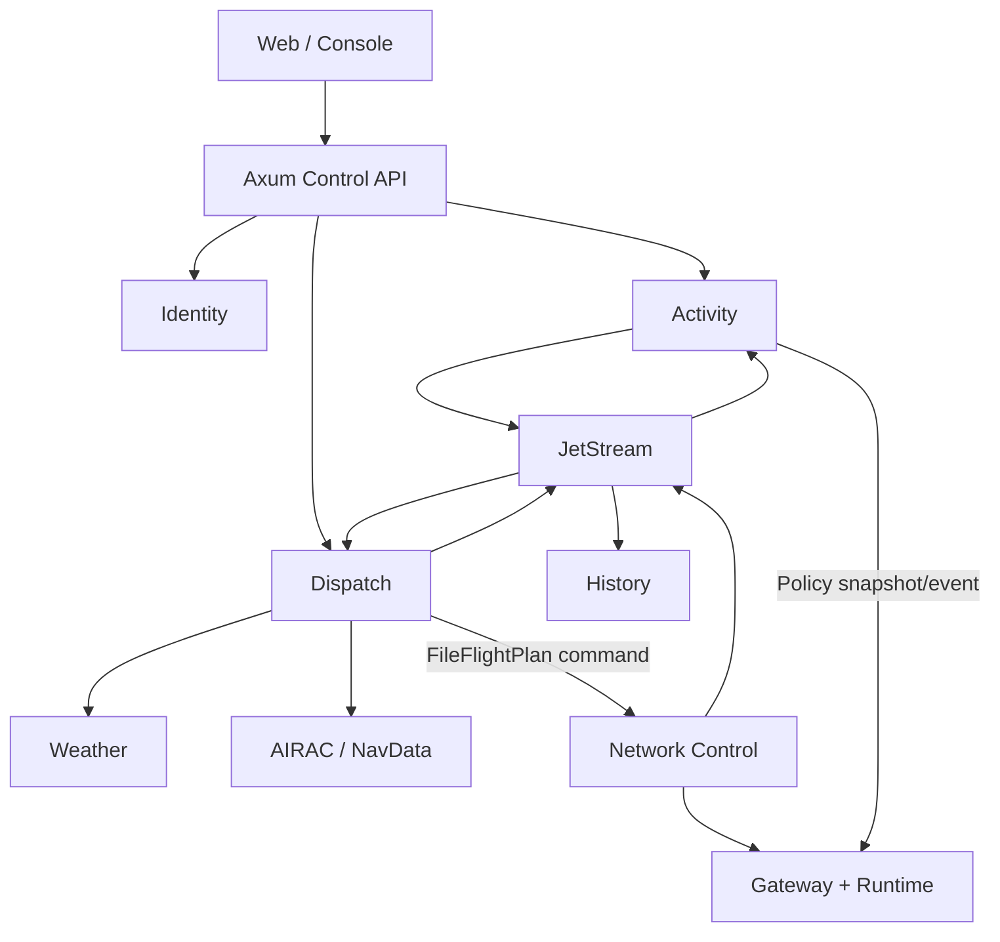
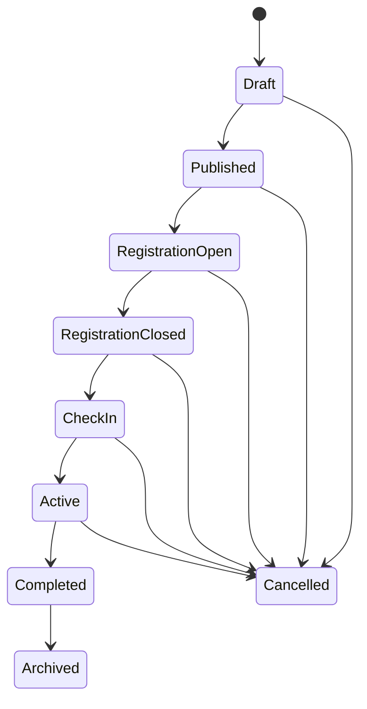
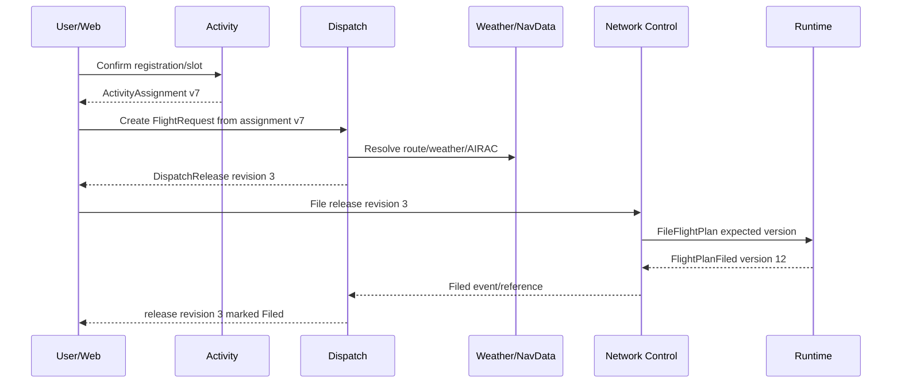

# RFC-0007：Activity and Dispatch Integration

| 字段 | 内容 |
| --- | --- |
| 状态 | Proposed |
| 日期 | 2026-08-17 |
| 负责产品组 | AsterFSD Platform |
| 影响范围 | Activity、Registration、Slot、Assignment、Dispatch、Operational Flight Plan、Network filing、Web、Identity、History、Weather、AIRAC |
| 上位 RFC | [RFC-0001](0001-asterfsd-platform-architecture.md)、[RFC-0003](0003-identity-and-trust-architecture.md)、[RFC-0005](0005-event-model-and-delivery-semantics.md)、[RFC-0006](0006-history-replay-and-telemetry-architecture.md) |
| 相关 RFC | [RFC-0002](0002-technology-stack-and-infrastructure-profiles.md)、[RFC-0004](0004-network-runtime-sharding-and-high-availability.md)、[RFC-0008](0008-weather-airac-and-route-data-plane.md) |
| 核心原则 | Activity 与 Dispatch 分域、在线状态归 Runtime、不可变 release revision、本地 policy projection、无共享数据库、显式 filing |

## 1. 摘要

AsterFSD Platform 的 Activity 模块负责活动、报名、席位、分配、签到和活动规则；Dispatch 模块负责飞行请求、航路候选、天气/AIRAC 引用、燃油载荷计划和不可变 Dispatch Release。Network Runtime 继续拥有当前在线 session、callsign、position 和 filed flight plan。

```text
Identity
  -> 谁在操作、属于哪个 Network、拥有什么 Rating/Permission

Activity
  -> 活动是什么、谁报名、分配什么席位、活动规则是什么

Dispatch
  -> 飞行前如何规划、使用哪个 AIRAC/Weather、生成哪一版 release

Network Runtime
  -> 当前谁在线、使用什么 callsign、当前 filed flight plan 是什么

History
  -> 过去发生了什么、使用了哪个 revision、轨迹和回放是什么
```

Activity 与 Dispatch 是两个独立 bounded context。Standalone/Compact 可以装配在同一个 binary，但它们保持独立 contract、repository、schema、event 和 migration。大型部署可以分别扩展为独立服务。



## 2. 目标

- 支持公司只运行一个 Network，也支持平台管理多个 Network；
- 支持活动创建、发布、报名、席位竞争、分配、签到、激活、完成和归档；
- 支持 Pilot、ATC、Observer、Staff 等不同 participation；
- 支持全 Network、空域、机场、航路、callsign 和时间范围活动规则；
- 支持 Dispatch Flight Request、route candidate、release revision 和 network filing；
- 固定 Activity、Dispatch、Identity、Runtime、History、Weather、NavData 的数据 ownership；
- Runtime 使用本地 versioned Activity policy projection，避免同步远程调用进入 packet path；
- 所有 mutation 使用 idempotency、expected version、audit 和 durable outbox；
- 支持 Standalone、Distributed、Kubernetes 使用同一 contract；
- 支持真实 classic/VATSIM/Aster 客户端参与活动；
- 支持未来 Web、自动分配、运营面板、统计和活动回放。

## 3. 非目标

本 RFC 不定义：

- 航路搜索算法；
- 燃油、性能和载重计算公式；
- Weather/AIRAC 的内部存储；
- 完整 ATC handoff 状态机；
- 票务、支付和商业结算；
- 活动页面 UI 视觉实现；
- 通过共享数据库连接 Activity、Dispatch 和 Runtime；
- 将 Dispatch Release 自动等同于 Network FlightPlan。

## 4. Domain ownership

| 领域数据 | Owner |
| --- | --- |
| Account、Membership、Rating、Permission | Identity |
| Activity definition、registration、slot、assignment、check-in | Activity |
| Flight request、route candidate、dispatch release/revision | Dispatch |
| 当前 session、callsign、position、filed flight plan | Network Runtime |
| Weather observation/forecast | Weather provider/service |
| AIRAC、route、procedure、airport data | NavData service |
| Timeline、track、replay、历史 projection | History |
| Web 聚合页面 | Control API/read model |

服务只能通过 Tonic、typed local port 或 RFC-0005 event contract 交流。Activity 不读取 Dispatch 数据库；Dispatch 不写 Runtime state；Web 不直接 join 服务数据库。

## 5. Crate 与服务边界

```text
aster_fsd_activity
├── Activity model/state machine
├── Registration/Slot/Assignment
├── ActivityPolicySnapshot
├── commands/events
└── ActivityRepository port

aster_fsd_activity_persistence
└── SQLite/PostgreSQL repository/outbox adapter

aster_fsd_dispatch
├── FlightRequest
├── RouteCandidate
├── DispatchRelease
├── filing orchestration
├── commands/events
└── DispatchRepository/Provider ports

aster_fsd_dispatch_persistence
└── SQLite/PostgreSQL repository/outbox adapter
```

约束：

- domain crate 不依赖 SeaORM、SQLx、Tonic、Axum 或 NATS；
- persistence crate 实现 repository/outbox；
- service/composition 边界实现 Tonic/Axum/NATS adapter；
- Activity 和 Dispatch 不建立互相 re-export 的 facade；
- 共用的 `NetworkId`、`MembershipId`、`ActivityId`、`DispatchId` 等强类型 ID 放在稳定 model/contract；
- 不建立一个包含 Activity、Dispatch、History 全部字段的 Platform DTO。

## 6. Activity model

```text
Activity
├── activity_id
├── organization_id
├── network_id
├── name / description
├── lifecycle_state
├── registration_window
├── activity_window
├── scope
├── capacity
├── policy_version
├── dispatch_constraints_version
├── created_by
├── created_at / updated_at
└── version
```

### 6.1 Lifecycle



规则：

- `Draft` 可编辑核心定义；
- `Published` 后破坏性字段通过 revision 修改；
- `RegistrationOpen` 接受报名与 hold；
- `CheckIn` 固定关键 assignment/policy generation；
- `Active` 发布 Runtime policy activation；
- `Completed` 关闭新 participation mutation；
- `Archived` 进入长期只读；
- `Cancelled` 产生原因、actor、affected assignment 和通知事件；
- 所有 transition 使用 expected version 和 idempotency key。

### 6.2 Scope

```text
ActivityScope
├── WholeNetwork
├── Airspace(regions)
├── Airports(icao[])
├── Routes(route_refs[])
├── Callsigns(patterns[])
└── Combined
```

scope 字段必须规范化、有数量和长度上限。callsign pattern 使用受控 DSL，不执行任意 regex。

## 7. Registration、Slot 与 Assignment

### 7.1 Registration

```text
ActivityRegistration
├── registration_id
├── activity_id
├── membership_id
├── participant_type
├── preferences
├── status
├── submitted_at
├── confirmed_at
└── version
```

状态：

```text
Submitted -> Confirmed -> CheckedIn -> Active -> Completed
Submitted -> Waitlisted
Waitlisted -> Confirmed
Submitted/Confirmed -> Withdrawn
Confirmed -> NoShow
```

唯一性至少包含 `(activity_id, membership_id, participant_type)`，是否允许多角色由 Activity policy 决定。

### 7.2 Slot

```text
ActivitySlot
├── slot_id
├── activity_id
├── slot_type
├── capacity
├── requirements
├── callsign_assignment
├── time_window
├── route/position reference
└── version
```

slot type 示例：

- ATC position；
- Pilot route；
- Airport departure/arrival bank；
- Aircraft category；
- Observer/Staff duty。

### 7.3 Hold state machine

```text
Available
  -> Held(expires_at)
  -> Confirmed
  -> CheckedIn
  -> Active
  -> Completed

Held -> Expired -> Available
Held/Confirmed -> Released -> Available
Confirmed -> NoShow
```

Hold transaction 使用数据库 server time、unique constraint、expected slot version 和 TTL。后台 sweeper 负责过期释放；确认操作再次校验 hold owner 和 expiry。

### 7.4 Assignment

```text
ActivityAssignment
├── assignment_id
├── activity_id
├── membership_id
├── slot_id
├── assigned_callsign
├── assigned_route
├── assigned_position
├── aircraft_constraints
├── valid_from / valid_until
├── policy_version
└── version
```

assignment 使用 MembershipId 作为主体，callsign 只是活动期内的分配属性。

## 8. Overlap 与 policy precedence

同一 Network 允许多个 Activity，但重叠 scope/time 必须在 activation 前检测。

优先级：

```text
Network emergency/operator policy
  > exclusive Activity policy
  > scoped Activity explicit priority
  > normal Network policy
```

约束：

- 同一 scope/time 最多一个 exclusive Activity；
- priority 相同且规则冲突时 activation 失败；
- policy snapshot 记录所有 contributing Activity 和 precedence decision；
- cancel/complete 后发布新 policy generation；
- Runtime 不根据事件到达顺序猜优先级。

## 9. ActivityPolicySnapshot

```text
ActivityPolicySnapshot
├── network_id
├── generation
├── policy_version
├── valid_from / valid_until
├── lease_until
├── activities[]
├── scopes[]
├── callsign_assignments[]
├── position_assignments[]
├── rating_requirements[]
├── capacity_rules[]
├── enforcement_rules[]
├── generated_at
└── checksum
```

Activity service 是 policy source。Gateway 维护只读 `ActivityPolicyProjection`：

```text
Activity event/snapshot
  -> validate NetworkId/version/checksum
  -> build generation N+1
  -> validate overlap/invariants
  -> atomic projection swap
  -> retain generation N for rollback window
```

### 9.1 Enforcement mode

```text
Observe
  记录违反规则，不改变 command 结果

Warn
  允许操作，同时产生用户/运营告警

Enforce
  在 admission 或相应 command 边界执行规则
```

### 9.2 Stale policy

| 状态 | Observe | Warn | Enforce |
| --- | --- | --- | --- |
| projection current | 记录 | 记录并告警 | 正常强制 |
| snapshot lease valid but transport down | 继续 | 继续并报告 lag | 继续现有 generation |
| lease expired | 只观测 | degraded warning | 活动范围的新 admission/mutation fail closed |

已有 TCP session 不因普通 Activity service outage 整体断开。明确的 Activity revoke/cancel/enforcement event 由 Runtime policy 执行对应 scoped action。

### 9.3 Classic/VATSIM compatibility

Classic/VATSIM 登录没有 Activity token。Runtime 使用：

```text
AuthenticatedPrincipal.membership_id
+ NetworkId
+ requested callsign/client type
+ local ActivityPolicyProjection
```

完成匹配。Aster 原生协议可以携带短期 `ActivityGrant`，但 grant 只优化 admission，仍校验当前 policy generation、NetworkId、membership 和 expiry。

## 10. Dispatch model

```text
FlightRequest
├── request_id
├── network_id
├── membership_id
├── activity_assignment_id optional
├── origin / destination / alternates
├── departure window
├── aircraft profile reference
├── preferences / constraints
├── requested_airac
└── version

DispatchRelease
├── dispatch_id
├── revision
├── flight_request_id
├── network_id
├── membership_id
├── route
├── fuel/load/performance summary
├── weather_snapshot_refs
├── airac_cycle_ref
├── activity_constraint_version
├── created_at / valid_until
├── supersedes_revision
├── status
└── checksum
```

### 10.1 Release revision

Dispatch Release 是不可变 revision：

```text
Draft request
  -> Release revision 1
  -> Release revision 2 supersedes 1
  -> Release revision 3 supersedes 2
```

已发布 revision 保留，修改产生新 revision。History 可以证明用户查看、确认、提交和实际 filed 的具体版本。

### 10.2 Status

```text
Prepared
  -> Released
  -> FilingRequested
  -> Filed
  -> Superseded

Prepared/Released -> Cancelled
Released -> Expired
```

`Filed` 只在 Dispatch 消费并验证 `FlightPlanFiled` 后产生。Dispatch 自己不声明 Runtime 已接受计划。

## 11. Provider integration

Dispatch 通过 port 使用 Weather 和 NavData：

```text
trait WeatherPlanningProvider
trait RoutePlanningProvider
trait AircraftPerformanceProvider
```

每个结果携带：

- provider/source；
- schema/model version；
- observed/generated time；
- valid_from/valid_until；
- AIRAC cycle；
- checksum；
- quality/stale marker。

Dispatch Release 保存 reference 和必要的不可变摘要，不复制整个 provider 数据库。

Provider outage：

- 有效 cache/snapshot 可以按 Network policy 使用；
- stale 数据明确标记；
- route/weather 缺失不伪造成功；
- retry 有 deadline/budget；
- provider 错误进入 typed result，不进入 Runtime packet path。

## 12. Activity 与 Dispatch 集成



Activity assignment 变化时：

```text
ActivityAssignmentChanged
  -> Dispatch projection updates constraint version
  -> affected Release marked PolicyStale
  -> user/operator creates new revision
```

已经 filed 的 Network FlightPlan 保持当前版本，更新必须经过明确 `FileFlightPlan/AmendFlightPlan` command。

## 13. Network filing

Filing request：

```text
FileDispatchRelease
├── network_id
├── membership_id
├── dispatch_id / revision
├── target_session_id optional
├── expected_flight_plan_version
├── idempotency_key
└── actor/context
```

Network Control 验证：

- principal 与 release membership；
- NetworkId；
- release status/expiry/checksum；
- Activity assignment/policy version；
- target session ownership；
- expected current flight plan version；
- protocol/model field limits。

成功链：

```text
Network Runtime commits FlightPlan version N+1
  -> FlightPlanFiled durable event
  -> History projection
  -> Dispatch consumer marks revision Filed
  -> Activity projection associates assignment/session/flight
```

response 丢失时，调用方使用同一 idempotency key 查询已提交结果。

## 14. Commands 与 events

### 14.1 Activity commands

```text
CreateActivity
PublishActivity
OpenRegistration
HoldSlot
ConfirmRegistration
AssignSlot
CheckInParticipant
ActivateActivity
CompleteActivity
CancelActivity
```

### 14.2 Activity events

```text
ActivityPublished
RegistrationOpened
SlotHeld
SlotHoldExpired
RegistrationConfirmed
AssignmentChanged
ParticipantCheckedIn
ActivityActivated
ActivityCompleted
ActivityCancelled
ActivityPolicyPublished
```

### 14.3 Dispatch commands

```text
CreateFlightRequest
GenerateRouteCandidates
CreateDispatchRelease
SupersedeDispatchRelease
CancelDispatchRelease
RequestNetworkFiling
```

### 14.4 Dispatch events

```text
FlightRequestCreated
RouteCandidatesGenerated
DispatchReleaseCreated
DispatchReleaseSuperseded
DispatchReleasePolicyStale
DispatchReleaseCancelled
DispatchReleaseFilingRequested
DispatchReleaseFiled
```

所有 command/event 遵循 RFC-0005 envelope、Network scope、version、idempotency、outbox 和 consumer inbox 语义。

## 15. Tonic contract

### 15.1 Activity service

```text
CreateActivity
UpdateActivity
PublishActivity
ListActivities
GetActivity
RegisterParticipant
HoldSlot
ConfirmSlot
CheckIn
GetAssignment
GetPolicySnapshot
StreamPolicyGenerations
```

### 15.2 Dispatch service

```text
CreateFlightRequest
GenerateRouteCandidates
CreateRelease
GetRelease
ListRevisions
SupersedeRelease
CancelRelease
RequestFiling
GetFilingStatus
```

要求：

- deadline、cancellation、request id；
- authenticated service/human principal；
- Network authorization；
- idempotency key；
- expected version；
- bounded list/page/stream；
- typed gRPC status/error details；
- password/token 不进入业务 payload/log/event。

## 16. Persistence

Activity schema ownership：

```text
activities
activity_revisions
activity_slots
slot_holds
activity_registrations
activity_assignments
activity_policy_generations
activity_outbox
activity_inbox
activity_audit
```

Dispatch schema ownership：

```text
flight_requests
route_candidates
dispatch_releases
dispatch_release_revisions
dispatch_filing_requests
dispatch_provider_snapshots
dispatch_outbox
dispatch_inbox
dispatch_audit
```

约束：

- Activity/Dispatch 表不互相建立跨 schema 外键；
- 跨服务 ID 只保存 typed reference；
- mutation 与 audit/outbox 同 transaction；
- hold expiry 使用 database server time；
- unique constraint 固定 slot/registration/revision 并发语义；
- SQLite 是 Standalone 验证；Distributed/Kubernetes 默认 PostgreSQL；
- MySQL 保留兼容 adapter，但不降低 transaction/unique/lease 语义。

## 17. Failure model

| 故障 | Runtime | Activity | Dispatch |
| --- | --- | --- | --- |
| Activity service down | 本地 policy lease 内继续 | 新 mutation 暂停 | 使用已缓存 assignment，标记 lag |
| Policy lease expired | 普通 Network 流量继续；Activity Enforce scope fail closed | 恢复后发布 generation | 新 activity-bound release 暂停 |
| Dispatch down | 已 filed flight plan 继续 | 无影响 | 新规划/filing request 暂停 |
| Weather down | 无影响 | 无影响 | 使用有效 snapshot 或 typed failure |
| NavData down | 无影响 | 无影响 | 使用有效 AIRAC cache 或 typed failure |
| JetStream down | packet path 继续 | mutation 进入 bounded outbox | mutation 进入 bounded outbox |
| History down | packet path 继续 | owner transaction 继续 | owner transaction 继续 |
| PostgreSQL down | 已加载 policy 继续 | mutation 失败 | mutation 失败 |
| Duplicate filing | idempotency 返回原结果 | 无影响 | inbox/filing key 去重 |
| Activity cancelled | scoped policy generation 更新 | assignments cancelled | affected release PolicyStale |

Activity/Dispatch outage 不全局关闭 Network。只有明确配置的 Activity `Enforce` scope 在 policy lease 失效后收紧新 admission/mutation。

## 18. Security 与 privacy

- Activity/Dispatch 每次 command 校验 NetworkMembership 和 capability；
- ATC slot requirement 使用 Identity 的强类型 Rating/Permission；
- Activity staff role 不等同于 Network administrator；
- Dispatch Release 只允许 owner、授权 dispatcher 或 operator 查看/修改；
- provider credential 只存在于 provider adapter；
- activity assignment、route 和 track export 受 Network policy；
- NATS subject 按 Network/service 限制；
- policy snapshot 经过 checksum/version/service identity 校验；
- Web 不向浏览器暴露 service credential；
- audit 保存 actor reference、action、scope、result，不保存 password/token。

## 19. 性能与分配

Runtime policy lookup：

```text
NetworkId + MembershipId + Callsign + scope
  -> immutable ActivityPolicyProjection
  -> bounded lookup
  -> decision
```

约束：

- packet position path 不进行 Activity/Dispatch gRPC；
- policy generation 原子 swap；
- callsign/assignment index 预规范化；
- 不在每个 packet clone 整个 policy；
- 不使用全局可变 registry 或 `Box<dyn Rule>` 遍历；
- rule 数、scope 数、callsign pattern 数有上限；
- slot/registration mutation 使用 bounded transaction/deadline；
- route generation 使用独立 worker/concurrency budget；
- event/outbox/retry queue 有界。

## 20. 可观测性

Activity：

- activity state/version；
- registrations、waitlist、holds、expired holds；
- slot conflicts；
- policy generation/lease/lag；
- overlap conflict；
- check-in/no-show；
- outbox/inbox depth/age。

Dispatch：

- request/release/revision count；
- route generation latency/failure；
- provider cache age/stale；
- filing requested/succeeded/conflict/expired；
- policy stale release；
- outbox/inbox depth/age。

Runtime：

- active policy generation；
- Observe/Warn/Enforce decisions；
- stale/expired policy；
- activity admission denial；
- assignment/callsign mismatch。

高基数 MembershipId、ActivityId、DispatchId、callsign 不作为常规 Prometheus label。

## 21. Deployment Profile

### 21.1 Standalone

```text
asterfsd
├── embedded Identity
├── embedded Activity
├── optional embedded Dispatch
├── Network Runtime
├── embedded History
└── SQLite logical schemas
```

### 21.2 Distributed Compact

```text
Gateway/Runtime
Identity
Activity + Dispatch composition binary
History
PostgreSQL service-owned schemas
Core NATS + JetStream
```

同一 binary 内仍通过明确 application service/repository boundary 装配，不直接跨 schema join。

### 21.3 Kubernetes Large

```text
Gateway shards
Identity service
Activity service
Dispatch service/workers
Weather service
NavData service
History ingest/query
PostgreSQL
NATS JetStream
ClickHouse/S3
```

Activity policy publisher、Dispatch route worker 和 filing orchestrator 可以独立扩展。migration、schema compatibility、policy generation、outbox lag 和 provider health 进入 rollout gate。

## 22. 测试矩阵

### 22.1 Activity

- lifecycle legal/illegal transition；
- concurrent registration/slot hold；
- hold expiry/confirm race；
- capacity/waitlist；
- duplicate/idempotency；
- Activity cancel；
- overlapping policy/precedence；
- policy generation/checksum/lease；
- Observe/Warn/Enforce；
- Classic/VATSIM membership + callsign mapping；
- Network isolation。

### 22.2 Dispatch

- immutable revision/supersede；
- provider success/stale/failure；
- AIRAC mismatch；
- activity constraint version；
- expired release；
- concurrent filing；
- expected flight plan version conflict；
- response lost/idempotency retry；
- FlightPlanFiled projection；
- Network isolation。

### 22.3 Integration

- Web -> Activity -> assignment；
- assignment -> Dispatch release；
- Dispatch -> Network filing -> History；
- Activity policy -> Runtime admission；
- activity cancel -> policy update -> release stale；
- JetStream duplicate/out-of-order/gap；
- Activity/Dispatch/Weather/NavData outage；
- PostgreSQL rollback/outbox recovery；
- Kubernetes drain/rolling schema compatibility；
- real Swift/Pilot/ATC activity login and filing。

## 23. 排除方案

### Activity 和 Dispatch 合并成一个业务表

Activity 管参与和规则，Dispatch 管飞行规划和不可变 release。它们演进、权限、worker 和查询负载不同，保持独立 bounded context。

### Runtime 每次登录同步调用 Activity

Activity outage 会扩散到 Network admission。Runtime 使用 versioned local policy projection 和 bounded lease。

### Dispatch 直接写 Runtime 数据库

Runtime 没有给 Dispatch 共享的权威数据库。Filing 使用明确 Network command、expected version 和 idempotency。

### Dispatch Release 自动成为 filed flight plan

Release 是规划文档，FlightPlanFiled 是 Runtime 提交事实。两者通过 filing workflow 关联。

### callsign 作为活动参与者身份

callsign 是 assignment 属性。参与者身份使用 NetworkMembership/MembershipId。

### 覆盖旧 Dispatch revision

会失去用户实际查看和 filing 的版本证据。release revision 不可变，修改产生 superseding revision。

### 活动规则使用任意脚本/regex

Runtime 热路径和安全边界需要受控 typed rule/DSL、数量上限和预编译 projection。

## 24. 实施约束

- Activity、Dispatch、Runtime、Identity、History 保持独立 owner；
- Standalone/Compact 允许同进程，不共享 repository/entity；
- Activity policy 以 versioned snapshot/event 投影到 Runtime；
- packet 热路径不调用 Activity/Dispatch；
- Activity Enforce 只作用于明确 scope；
- Classic/VATSIM 通过 principal membership + callsign 匹配；
- Dispatch Release revision 不可变；
- Network filing 使用 command、expected version、idempotency；
- Runtime 的 FlightPlanFiled 才是在线计划提交事实；
- provider 数据使用 reference/version/checksum；
- mutation 与 audit/outbox 原子提交；
- policy、slot、route、queue 和 worker concurrency 全部有界；
- credential、token、完整 provider secret 不进入 event/log；
- 内部重构一次迁移调用方，删除旧共享表、直接 DB 写入和同步 Activity lookup 路径。

## 25. 完成标准

1. Activity 与 Dispatch 使用独立 domain、repository、schema 和 event contract。
2. Standalone、Compact、Kubernetes 使用同一 command/event/policy model。
3. slot hold/confirm/expiry 在并发和 crash 下保持唯一、幂等和可恢复。
4. Activity lifecycle、registration、assignment、check-in 和 cancellation 状态机完整测试。
5. overlapping Activity policy 在 activation 前确定 precedence 或报告冲突。
6. Runtime 使用 atomic local policy projection，packet path 无远程 Activity/Dispatch 调用。
7. Observe/Warn/Enforce 和 stale lease 有准确结果。
8. Classic/VATSIM/Aster 客户端均可映射 Activity participation。
9. Dispatch release revision 不可变，并绑定 Weather/AIRAC/Activity constraint version。
10. filing 在 duplicate、conflict、response loss、expiry 和 policy stale 下保持正确。
11. Dispatch 只在消费 `FlightPlanFiled` 后标记 release Filed。
12. Activity/Dispatch/Weather/NavData/History outage 不扩散到 Runtime packet 热路径。
13. Network scope、permission、privacy、subject 和 export 有边界测试。
14. outbox/inbox、policy generation、provider cache、route worker 和 filing lag 可观测。
15. README、config、developer docs、proto、migration、测试和 changelog 与实现同步。

## 26. 后续 ADR/RFC

- Activity/Registration/Slot/Assignment Protobuf contract；
- Activity policy typed rule catalog 和 precedence；
- slot hold transaction、TTL 和 waitlist strategy；
- Dispatch Release/FlightRequest schema；
- Weather/NavData provider request/response contract；
- Network filing Tonic API 和 idempotency result store；
- Compact Activity+Dispatch composition binary；
- Web Activity/Dispatch permission and API catalog；
- [RFC-0008](0008-weather-airac-and-route-data-plane.md) Weather, AIRAC and Route Data Plane；
- [RFC-0009](0009-atc-coordination-and-handoff-state-machine.md) ATC Coordination and Handoff State Machine。

这些 ADR 可以细化字段、规则和算法，但需要保持 Activity/Dispatch 分域、Runtime 在线权威、不可变 release revision、本地 policy projection 和显式 filing workflow。
