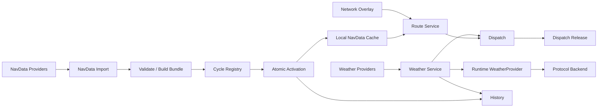

# RFC-0008：Weather, AIRAC and Route Data Plane

| 字段 | 内容 |
| --- | --- |
| 状态 | Proposed |
| 日期 | 2026-08-17 |
| 负责产品组 | AsterFSD Platform |
| 影响范围 | Weather、METAR/TAF、AIRAC、Airport/Airway/Procedure/Sector、Route Resolution、Provider Sync、Dispatch、Runtime weather query、History |
| 上位 RFC | [RFC-0001](0001-asterfsd-platform-architecture.md)、[RFC-0002](0002-technology-stack-and-infrastructure-profiles.md)、[RFC-0005](0005-event-model-and-delivery-semantics.md)、[RFC-0007](0007-activity-and-dispatch-integration.md) |
| 相关 RFC | [RFC-0004](0004-network-runtime-sharding-and-high-availability.md)、[RFC-0006](0006-history-replay-and-telemetry-architecture.md) |
| 核心原则 | 时效数据与版本化资料分离、AIRAC immutable cycle、Network overlay、显式 provenance、原子 activation、provider 可替换、离线可运行 |

## 1. 摘要

AsterFSD 的 Weather、NavData/AIRAC 和 Route Resolution 属于三个不同 bounded context：

```text
Weather
  -> 当前观测、预报、有效期、质量和原始报文

NavData
  -> AIRAC cycle、机场、航路点、航路、程序、扇区和资料 bundle

Route
  -> 使用指定 AIRAC generation、Network overlay 和约束计算/校验航路
```

Weather 数据随时间快速变化；AIRAC 是不可变、可验证、按周期激活的数据集；Route 是对某个明确数据 generation 的计算结果。三者分离后，Dispatch Release 可以准确记录“使用了哪份天气、哪个 AIRAC、哪些 Network override、哪个 route engine 版本”。



关键决策：

1. Weather、NavData、Route 分开建模和部署，Compact Profile 可同进程装配。
2. AIRAC cycle 导入后不可变；修正产生新 bundle revision，不原地修改已激活数据。
3. 一个 Network 在某一时刻只有一个 active base cycle generation，可叠加 versioned Network overlay。
4. activation 使用 staging、validation、checksum、generation 和原子指针切换。
5. Dispatch Release 固定 WeatherSnapshotRef、AiracCycleRef、OverlayGeneration 和 RouteEngineVersion。
6. Runtime `WeatherProvider` 查询使用 bounded async control path；position packet 热路径不访问 Weather/NavData/Route。
7. Classic `#WX/#TD/#WD/#CD`、VATSIM 和 Aster weather wire 只属于 protocol backend；Weather service 返回统一模型。
8. Standalone 使用嵌入/本地 bundle 与本地 weather adapter，Distributed/Kubernetes 使用 Tonic、object storage、PostgreSQL metadata 和本地 cache。

## 2. Ownership

| 数据 | Owner |
| --- | --- |
| METAR/TAF/forecast/observation | Weather |
| Airport、waypoint、airway、procedure、sector | NavData |
| AIRAC cycle metadata、bundle、activation | NavData Registry |
| Network 自定义机场/航路/扇区覆盖 | Network Overlay owner |
| Route candidate、validation、cost | Route Service |
| Dispatch Release | Dispatch |
| Runtime 当前 weather response effect | Network Runtime + protocol backend |
| 历史 weather snapshot、cycle activation | History |

Weather 不修改 NavData；NavData 不保存 Dispatch Release；Route 不拥有 AIRAC；Runtime 不读取 provider 数据库。

## 3. Crate 与服务边界

```text
aster_fsd_weather
├── WeatherObservation / Forecast / Snapshot
├── WeatherProvider port
├── freshness/quality policy
└── provider-neutral errors

aster_fsd_navdata
├── AiracCycle / DatasetGeneration
├── Airport / Waypoint / Airway / Procedure / Sector
├── NavDataStore port
├── validation report
└── NetworkOverlay

aster_fsd_route
├── RouteRequest / RouteCandidate
├── RouteResolver port
├── constraint/cost model
└── route validation result
```

adapter：

```text
weather_provider_<source>
navdata_import_<source>
navdata_storage_<backend>
route_engine_<implementation>
```

domain crate 不依赖 Tonic、Axum、NATS、SeaORM 或具体 provider SDK。协议 backend 只消费统一 WeatherProfile/Route model。

## 4. Weather model

```text
WeatherObservation
├── station
├── kind
├── raw_text optional
├── parsed_profile
├── source
├── observed_at
├── received_at
├── valid_from / valid_until
├── quality
├── correction/amendment
├── schema_version
└── checksum
```

支持：

- METAR/SPECI；
- TAF；
- wind/temperature layers；
- pressure/visibility/cloud；
- provider-specific forecast 经 adapter 归一；
- Network/operator override，必须带来源、原因和 expiry。

### 4.1 Freshness

```text
Fresh
StaleAllowed
Expired
Invalid
Unavailable
```

每种用途定义独立 policy：

| 用途 | 允许状态 |
| --- | --- |
| Runtime weather query | Fresh；按 Network policy 可 StaleAllowed |
| Dispatch release | Fresh 或显式接受的 StaleAllowed，并固定 snapshot |
| Historical display | AsRecorded，保留当时 quality |
| Automated safety rule | 只使用满足该 rule policy 的 observation |

stale response 必须携带 age/source/quality，协议 backend 按 dialect 能力编码；日志和指标记录 stale decision。

### 4.2 Provider merge

多个 provider 不按“最后到达者获胜”。选择使用：

```text
station + observation kind
  -> source priority
  -> correction/amendment
  -> observed_at
  -> quality
  -> deterministic tie-breaker
```

所有候选保留 provenance；canonical current view 记录 selection reason。

## 5. Runtime WeatherProvider

现有 `aster_fsd_core::WeatherProvider` port 继续作为 Runtime 唯一入口：

```text
WeatherLookup
├── network_id
├── station/coordinate
├── requested products
├── maximum_age
├── deadline
└── request context
```

```text
WeatherResult
├── observation/forecast snapshot
├── source/quality/freshness
├── observed_at/valid_until
├── checksum
└── provider diagnostics class
```

调用边界：

- weather request 属于低频 control path；
- 每连接、每 station 有 rate limit；
- request 有 deadline/cancellation；
- cache key 带 Network/station/product；
- single-flight 防止 cache miss 风暴；
- provider outage 不阻塞其他 command；
- password、完整登录 frame 不进入 lookup/log。

Classic backend 继续按 C FSD 顺序编码 `#TD/#WD/#CD`；raw METAR、VATSIM 扩展和 Aster JSON 由各 backend 独立映射。

## 6. Weather sync pipeline

```text
provider poll/stream
  -> authenticate/fetch
  -> parse and validate
  -> normalize units
  -> deduplicate/correction merge
  -> update canonical view
  -> publish WeatherObservationUpdated event
  -> optional WeatherObservationBatch telemetry
```

配置：

- poll interval；
- request concurrency；
- timeout/retry budget；
- station allowlist；
- cache/retention；
- provider quota；
- circuit breaker；
- maximum response bytes。

provider secret 只存在于 adapter/Secret manager，不写入 event、History、config example 和日志。

## 7. AIRAC 与 DatasetGeneration

```text
AiracCycle
├── cycle_id
├── effective_from / effective_until
├── source
├── source_revision
├── imported_at
├── dataset_generation
├── schema_version
├── bundle_uri
├── checksum
├── validation_report
└── state
```

状态机：

```text
Imported
  -> Validated
  -> Staged
  -> Active
  -> Superseded

Imported/Validated/Staged -> Rejected
Active -> Withdrawn (explicit emergency action)
```

已激活 generation immutable。源资料修订产生新的 `dataset_generation`，即使 AIRAC cycle 名相同也保持独立 checksum 和 activation record。

## 8. NavData bundle

Bundle 至少包含：

```text
manifest
airports
runways
waypoints/navaids
airways
SID/STAR/approach procedures
airspace/sectors
frequencies
route restrictions
source metadata
```

Manifest：

```text
NavDataManifest
├── schema_version
├── cycle_id
├── generation
├── source_revision
├── object list/checksums
├── entity counts
├── geographic coverage
├── generated_at
├── signer/source identity
└── root checksum
```

Bundle 使用 immutable object storage；metadata/activation 存 PostgreSQL/SQLite。运行节点下载到本地 cache，先验证 manifest/checksum，再暴露给 Route/Runtime。

## 9. Validation

activation 前至少验证：

- manifest 与所有 object checksum；
- schema version；
- entity ID 唯一；
- 坐标、海拔、频率范围；
- airway endpoint/sequence；
- procedure leg reference；
- airport/runway consistency；
- sector geometry validity；
- dangling reference；
- entity count/change ratio；
- 与当前 active generation 的差异报告；
- route conformance fixture；
- memory/index build benchmark。

validation report 使用 severity：

```text
Info
Warning
Error
Fatal
```

Fatal 阻止 staging；Error 默认阻止 activation，operator override 需要 reason、actor 和 audit。

## 10. Atomic activation

```text
import generation N+1
  -> validate
  -> stage bundle
  -> warm local/service caches
  -> run conformance
  -> create activation record
  -> atomic Network active-generation swap
  -> publish AiracGenerationActivated
  -> retain generation N for rollback window
```

每个 Network 的 active pointer：

```text
ActiveNavDataGeneration
├── network_id
├── base_cycle/generation
├── overlay_generation
├── activated_at
├── activated_by
├── previous_generation
└── version
```

Route request、Dispatch Release、History event 都保存 generation reference。长请求在开始时 pin generation，处理中不切换。

## 11. Network overlay

Network overlay 用于：

- 自定义机场/航路点；
- 临时航路关闭；
- 活动扇区/频率；
- 本地 procedure/route restriction；
- provider 数据修正。

```text
NetworkOverlay
├── network_id
├── generation
├── based_on_cycle_generation
├── changes[]
├── valid_from / valid_until
├── reason/source
├── checksum
└── state
```

Overlay 不修改 base bundle。冲突和 dangling reference 在 activation 前验证。Overlay expiry 生成新 active pointer/version，不在查询时悄悄忽略。

## 12. Route Service

```text
RouteRequest
├── network_id
├── origin/destination/alternates
├── aircraft capabilities
├── departure time
├── requested cycle/overlay generation
├── activity constraints
├── avoid/prefer rules
├── maximum candidates
└── deadline
```

```text
RouteCandidate
├── route_id
├── normalized route
├── legs
├── distance/cost
├── validation result
├── cycle/overlay generation
├── route engine version
├── warnings
└── checksum
```

Route Service 负责计算和验证，不拥有 Dispatch Release。结果必须 deterministic under same input/generation/engine version，或明确记录随机 seed/policy variation。

### 12.1 Route validation

- entity/procedure 存在；
- sequence 连通；
- direction/restriction；
- aircraft capability；
- activity constraints；
- departure time/validity；
- Network overlay；
- field length 和 protocol filing limit；
- warning/error classification。

## 13. Dispatch binding

Dispatch Release 固定：

```text
WeatherSnapshotRef
├── source
├── observed_at
├── valid_until
└── checksum

RouteDataRef
├── airac_cycle
├── dataset_generation
├── overlay_generation
├── route_engine_version
└── route_checksum
```

AIRAC/overlay 更新后，旧 release 保持历史有效，但状态可标记：

```text
Current
DataStale
PolicyStale
Expired
```

重新规划产生新 Dispatch revision，不覆盖旧 release。

## 14. Commands 与 events

Weather commands/events：

```text
RefreshWeatherSource
SetNetworkWeatherOverride
ClearNetworkWeatherOverride

WeatherObservationUpdated
WeatherOverrideActivated
WeatherOverrideExpired
WeatherProviderDegraded
```

NavData commands/events：

```text
ImportNavDataGeneration
ValidateNavDataGeneration
StageNavDataGeneration
ActivateNavDataGeneration
RollbackNavDataGeneration
PublishNetworkOverlay

NavDataGenerationImported
NavDataGenerationValidated
AiracGenerationActivated
AiracGenerationRolledBack
NetworkOverlayActivated
```

所有 mutation 使用 expected version、idempotency、audit、outbox 和 RFC-0005 envelope。

## 15. Tonic API

Weather：

```text
GetWeather
BatchGetWeather
GetWeatherSnapshot
ListProviderStatus
RefreshSource
```

NavData：

```text
GetActiveGeneration
GetGenerationManifest
ListCycles
ValidateGeneration
ActivateGeneration
GetNetworkOverlay
StreamBundle
```

Route：

```text
ResolveRoutes
ValidateRoute
NormalizeRoute
GetRouteExplanation
```

API 有 Network authorization、deadline、bounded list/stream、schema version、typed error 和 request id。Bundle 下载使用 object storage signed URL 或 bounded gRPC stream，并验证 checksum。

## 16. Persistence 与 cache

Metadata schema：

```text
weather_observations/current view/provider status
navdata_cycles/generations/manifests/activation
network_overlays/overlay_generations
route_cache
outbox/inbox/audit
```

存储：

- SQLite：Standalone metadata/local bundle/cache；
- PostgreSQL：Distributed/Kubernetes metadata、activation、audit；
- S3：immutable NavData bundle、validation artifact；
- local mmap/read-only index：Route 热查询；
- History/ClickHouse：长期 weather/activation analytics。

cache key 包含 Network、generation、overlay、request constraints 和 engine version。cache entry 带 checksum、created/expires 和 negative-cache policy。

## 17. Failure model

| 故障 | Runtime | Dispatch/Route | Control Plane |
| --- | --- | --- | --- |
| Weather provider down | valid cache/policy；typed unavailable | snapshot stale/failed | provider degraded |
| Weather service down | bounded local cache | release generation 暂停 | mutation/query degraded |
| NavData source down | active bundle 继续 | active generation 继续 | import 暂停 |
| Object storage down | cached bundle 继续 | cached generation 继续 | new node/activation 受限 |
| Route service down | 无 packet 影响 | route calculation 暂停 | existing release 继续 |
| PostgreSQL down | active local projection 继续 | pinned cache 继续 | activation/mutation 暂停 |
| Bad generation | current active 保持 | current generation 继续 | candidate rejected |
| Activation event delayed | old generation lease 内继续 | response 带 generation | lag 可观测 |
| Overlay expired | atomic generation 更新 | old release 标记 stale | audit/event |

已 pin 的 request/release 使用原 generation 完成。新 request 使用 current active generation。activation 不修改进行中的结果。

## 18. Security

- provider credential 分开管理和轮换；
- bundle manifest/checksum/signature 校验；
- activation/rollback 需要高权限 actor 和 audit；
- Network overlay 只能修改自身 Network；
- route/weather query 设置资源和速率上限；
- raw provider response 经过大小、编码和 parser 边界；
- object storage prefix/IAM 按 dataset/network；
- NATS event subject 最小权限；
- 日志记录 source/generation/error class，不记录 secret/full credential。

## 19. 性能与分配

- Runtime weather query 不进入 position 热路径；
- station cache 与 single-flight 有界；
- NavData bundle 构建只读 compact index；
- generation swap 使用 immutable handle/atomic pointer；
- Route query pin `Arc` generation，避免复制全数据集；
- 不用 `Box` 隐藏每 leg/waypoint 热循环分配；
- route candidate 数、legs、avoid/prefer rules 有上限；
- provider response、bundle、stream chunk 有 byte limit；
- benchmark 报告 index build/load、RSS、lookup/route p50/p95/p99、allocation 和 cache hit。

## 20. Deployment Profile

Standalone：

```text
asterfsd
├── embedded WeatherProvider/cache
├── local NavData bundle
├── embedded Route Service
└── SQLite metadata
```

Distributed Compact：

```text
Weather + NavData + Route composition service
PostgreSQL metadata
S3 bundle
Gateway local cache
Tonic
```

Kubernetes Large：

```text
Weather ingest/query
NavData registry/import workers
Route service replicas
PostgreSQL
S3/object storage
NATS JetStream
Gateway/Dispatch local generation cache
```

import、validation、index build、route compute 使用独立 worker/concurrency budget。activation 进入 rollout gate 和 rollback rehearsal。

## 21. 可观测性

- provider fetch latency/error/quota；
- weather station freshness/stale/invalid；
- cache hit/miss/single-flight；
- generation import/validation duration；
- validation errors/change ratio；
- bundle bytes/checksum/cache load；
- active generation/overlay/lease；
- activation/rollback lag；
- route request latency/candidate count/failure；
- stale Dispatch Release count；
- provider/outbox/inbox depth/age。

station、route、request ID 不作为常规 Prometheus label。

## 22. 测试矩阵

Weather：

- METAR/TAF/raw/parsed round trip；
- units/ranges/invalid input；
- correction/provider precedence；
- fresh/stale/expired；
- cache/single-flight/rate limit；
- provider timeout/quota/malformed response；
- Classic exact `#TD/#WD/#CD`；
- VATSIM/Aster mapping；
- no secret/log leakage。

NavData：

- manifest/checksum/signature；
- dangling references/geometry/ranges；
- import/validate/stage/activate/rollback；
- concurrent activation/version conflict；
- overlay conflict/expiry；
- immutable old generation；
- bundle corrupt/cache recovery；
- SQLite/PostgreSQL/S3 profile。

Route/Dispatch：

- deterministic result with pinned generation；
- AIRAC/overlay mismatch；
- activity constraints；
- route limits/invalid leg；
- generation switch during request；
- stale release/new revision；
- provider/service outage；
- real flight plan filing。

## 23. 排除方案

### Weather、NavData 和 Route 一个万能 service/model

Weather 是时效数据，NavData 是 immutable dataset，Route 是计算。分开 ownership 和 contract，Compact Profile 再组合部署。

### 原地修改 active AIRAC

会破坏 Dispatch/History/replay 的可证明版本。修订产生新 generation，并通过 activation 指针切换。

### Dispatch 只保存 route 字符串

缺少 AIRAC、overlay、engine、weather 和 checksum，事后无法重现。Release 固定完整 references。

### Runtime 直接调用外部 Weather API

会把 provider credential、quota、格式和故障带入 Runtime。统一 WeatherProvider adapter/service 负责归一和 cache。

### Route 查询读取远程数据库逐 leg 查找

延迟和故障耦合过高。Route 使用本地 immutable generation index。

### Overlay 直接修改 base bundle

失去来源、rollback 和跨 Network 隔离。Overlay 独立 version/checksum/activation。

## 24. 实施约束

- Weather、NavData、Route 分域；
- AIRAC generation immutable；
- Network overlay 独立 version；
- activation 原子切换并保留 rollback generation；
- Dispatch pin Weather/AIRAC/overlay/engine/checksum；
- Runtime 只通过 WeatherProvider port；
- protocol backend 只做 unified model 与 wire mapping；
- position 热路径无 Weather/NavData/Route 调用；
- bundle/provider response/parser/cache/route 全部有界；
- credential 不进入 event/history/log；
- Standalone 使用本地 bundle，Distributed 使用同一 contract；
- 内部迁移删除旧 raw provider、可变 AIRAC 和直接 DB route lookup 路径。

## 25. 完成标准

1. Weather/NavData/Route 独立 domain、port、adapter 和 persistence ownership。
2. AIRAC import/validate/stage/activate/rollback 和 immutable generation 完整测试。
3. Network overlay 版本、冲突、expiry 和隔离可证明。
4. Weather provenance/freshness/provider merge 有确定结果。
5. Runtime weather query 有 deadline/cache/rate limit，协议 exact wire 通过。
6. Route request pin generation，activation 并发时结果稳定。
7. Dispatch Release 固定 Weather/AIRAC/overlay/engine/checksum reference。
8. provider、Weather、NavData、Route、S3、PostgreSQL 故障不扩散到 packet 热路径。
9. bundle/checksum/parser/stream/query 有资源边界与安全测试。
10. Standalone、Compact、Kubernetes 使用同一 contract 和 conformance fixture。
11. History 可查询 weather snapshot、cycle activation 和 release reference。
12. index build/load、route/weather p50/p95/p99、RSS、allocation 和 cache hit 有证据。

## 26. 后续 ADR/RFC

- Weather unified schema、freshness 和 provider precedence；
- METAR/TAF parser/conformance；
- NavData manifest/bundle/codec；
- AIRAC import/validation/activation schema；
- Network overlay typed change catalog；
- Route engine constraint/cost model；
- local immutable index representation；
- Weather/NavData/Route Tonic API；
- [RFC-0009](0009-atc-coordination-and-handoff-state-machine.md) ATC Coordination and Handoff State Machine。

这些 ADR 可以细化 provider、codec、算法和阈值，但需要保持 Weather/NavData/Route 分域、immutable generation、Network overlay、pinned references 和 Runtime 热路径隔离。
