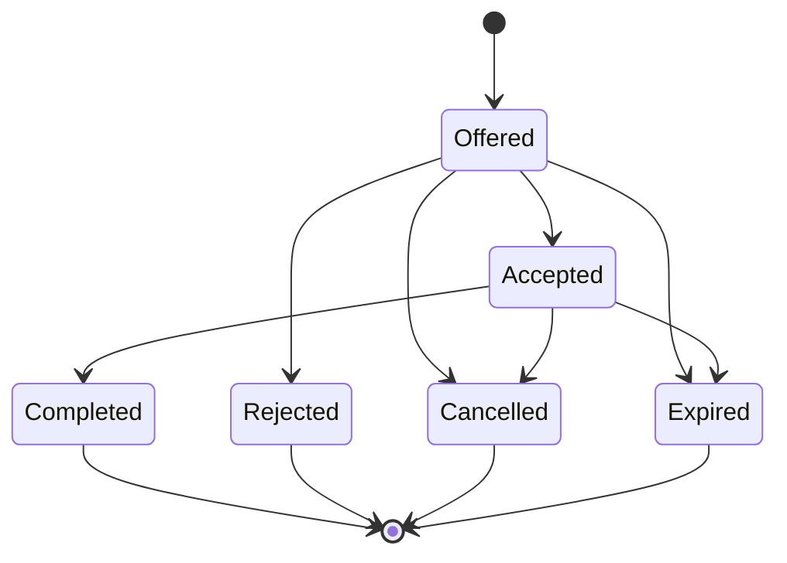

# RFC-0009：ATC Coordination and Handoff State Machine

| 字段 | 内容 |
| --- | --- |
| 状态 | Proposed |
| 日期 | 2026-08-17 |
| 影响范围 | ATC position、jurisdiction、tracking、handoff、frequency、cross-shard coordination、Classic/VATSIM/Aster mapping、History |
| 上位 RFC | [RFC-0001](0001-asterfsd-platform-architecture.md)、[RFC-0004](0004-network-runtime-sharding-and-high-availability.md)、[RFC-0005](0005-event-model-and-delivery-semantics.md)、[RFC-0007](0007-activity-and-dispatch-integration.md) |
| 相关 RFC | [RFC-0003](0003-identity-and-trust-architecture.md)、[RFC-0006](0006-history-replay-and-telemetry-architecture.md) |
| 核心原则 | live coordination 单一权威、typed state machine、version/fencing、wire adapter 兼容、disconnect 可恢复、History 可审计 |

## 1. 摘要

ATC coordination 负责 controller position、jurisdiction、pilot tracking 和 handoff。Classic FSD 的 `$HO/$HA` 可以表现为无状态 direct relay，但平台内部需要明确状态，才能处理重复、并发、timeout、controller disconnect、cross-shard delivery、Activity assignment 和未来 Aster 原生协同能力。

```text
Protocol command
  -> backend decode
  -> CoordinationCommand
  -> Network Runtime coordination state
  -> typed effects/events
  -> recipient backend encode
```

协议 backend 不拥有 handoff state；History 不决定当前 controller owner；Activity assignment 只决定 eligibility，不直接成为 live tracking ownership。

## 2. Ownership

| 数据 | Owner |
| --- | --- |
| Controller session/callsign/frequency | Network Runtime |
| Controller capability/rating | Identity principal |
| Activity ATC slot assignment | Activity |
| Live jurisdiction/tracking/handoff | Coordination domain in Network Runtime |
| Cross-shard target resolution | Network Directory + Runtime routing |
| Handoff timeline/replay | History |

## 3. Domain model

```text
ControllerPosition
├── controller_id/session_id
├── callsign
├── facility/type
├── frequency
├── rating/capabilities
├── activity_assignment optional
├── jurisdiction_ref
└── version

TrackedAircraft
├── aircraft_session_id
├── callsign
├── tracking_controller
├── tracking_since
├── ownership_version
└── active_handoff optional
```

`ConnectionId` 只用于本地 delivery；durable event 使用稳定 SessionId、HandoffId 和 controller/aircraft reference。

## 4. Jurisdiction

Jurisdiction 表示 controller 可操作的 scope：

```text
Jurisdiction
├── network_id
├── controller_position
├── sectors/airspace/airports
├── frequency
├── priority
├── valid_from/valid_until
├── source (Network/Activity/Operator)
├── generation
└── checksum
```

多个 jurisdiction 重叠时使用 Network policy、facility priority、Activity policy 和 explicit ownership version 决定；事件到达顺序不充当优先级。

## 5. Handoff state machine



```text
Handoff
├── handoff_id
├── network_id
├── aircraft_session_id
├── source_controller
├── target_controller
├── state
├── source_ownership_version
├── handoff_version
├── offered_at / expires_at
├── accepted_at / completed_at
├── reason
├── correlation_id
└── source_shard/epoch
```

## 6. Commands

```text
TrackAircraft
ReleaseAircraft
OfferHandoff
AcceptHandoff
RejectHandoff
CancelHandoff
CompleteHandoff
UpdateControllerFrequency
UpdateJurisdiction
```

所有 mutation 校验：

- active authenticated session；
- source callsign ownership；
- ATC capability/rating；
- NetworkId；
- aircraft/target controller 存在且 active；
- jurisdiction/policy；
- expected handoff/ownership version；
- ShardEpoch/claim version；
- idempotency key；
- timeout/expiry。

## 7. Offer、accept 与 completion

```text
OfferHandoff
  -> validate source tracks aircraft
  -> validate target eligibility
  -> create Handoff(Offered, version 1)
  -> durable HandoffOffered
  -> direct notification to target

AcceptHandoff
  -> target/version/expiry validation
  -> state Accepted(version 2)
  -> durable HandoffAccepted
  -> notify source and aircraft as dialect permits

CompleteHandoff
  -> atomically change tracking owner
  -> state Completed(version 3)
  -> durable HandoffCompleted
  -> publish current ownership projection
```

Accept 与 tracking ownership transfer 分开，允许协议/运营策略决定 transfer 的完成时刻。Aster 原生协议可以显式 complete；Classic compatibility policy 可以在 `$HA` accept 时完成 transfer。

## 8. Concurrency

- 一个 aircraft 同时最多一个 active `Offered/Accepted` handoff；
- source ownership version 变化后旧 offer 失效；
- target 对同一 HandoffId 重复 accept 返回原结果；
- accept 与 cancel 使用 expected handoff version 竞争，只有一个成功；
- late accept 在 expiry 后返回 expired；
- same version/different payload 是 integrity incident；
- old shard epoch command/effect 被 fencing 拒绝。

## 9. Disconnect semantics

Aircraft disconnect：

```text
release tracking ownership
  -> cancel/expire active handoff
  -> notify involved controllers
  -> durable AircraftTrackingEnded/HandoffCancelled
```

Source controller disconnect：

- Offered handoff 默认 cancelled；
- Accepted handoff按 policy complete 或 cancel；
- source tracking lease 释放；
- Activity assignment不自动转成 live owner。

Target controller disconnect：

- Offered handoff cancelled/expired；
- Accepted but incomplete handoff回退到 source或进入 untracked，取决于 verified current ownership；
- 不将旧 target connection复活为新 owner。

Shard crash 使用 RFC-0004 fencing。客户端重连产生新 SessionId/ConnectionRef；恢复 tracking 需要明确 reconcile/claim，不复用旧连接引用。

## 10. Cross-shard coordination

```text
source shard
  -> Directory resolve target callsign/session
  -> typed HandoffEnvelope(target shard/epoch)
  -> Core NATS direct subject
  -> target shard validates epoch/target/policy/version
  -> local effect
```

Durable lifecycle 通过 JetStream；实时 notification 使用 Core NATS。target shard 再次校验，Directory cache 不作为最终授权。

## 11. Protocol mapping

### 11.1 Classic

- `$HO/$HA` exact wire 保持 C FSD compatibility；
- backend 将 source/target/aircraft 字段映射为 typed command；
- compatibility mode 可将 accept 映射为 immediate complete；
- malformed/unknown target/version conflict 使用 Classic error mapping；
- backend 不维护第二份 handoff HashMap。

### 11.2 VATSIM

VATSIM 扩展按自身 backend contract 映射 identification、controller profile、handoff/ownership notification；Classic 行为不得被直接套用到 VATSIM listener。

### 11.3 Aster

Aster v1 暴露 HandoffId、state、version、expiry、reason 和 explicit completion，并允许未来协同 UI 使用结构化状态。

## 12. Events 与 History

```text
AircraftTrackingStarted
AircraftTrackingReleased
HandoffOffered
HandoffAccepted
HandoffRejected
HandoffCancelled
HandoffExpired
HandoffCompleted
ControllerJurisdictionChanged
ControllerFrequencyChanged
```

History 保存 timeline、actor、version、source/target、reason、Activity reference 和 gap。credential、完整 wire payload、socket address 不进入 durable event。

## 13. Failure model

| 故障 | 结果 |
| --- | --- |
| Directory unavailable | lease 内已有 resolution 有界使用；新 target resolve 失败 |
| Core NATS unavailable | local coordination继续；cross-shard command返回依赖错误或 durable policy |
| JetStream unavailable | state mutation进入 bounded outbox；强审计 operation按 policy收紧 |
| Target slow mailbox | 只处理对应 connection；handoff state由 timeout/reconcile收口 |
| Duplicate/redelivery | HandoffId/version/idempotency 去重 |
| Old epoch | fencing reject |
| Activity policy stale | current lease内校验；expired Enforce scope收紧新 operation |
| History unavailable | live coordination继续；outbox/lag 可观测 |

## 14. Security 与性能

- kill/handoff/jurisdiction command 校验 capability 和 source ownership；
- target reference 不授予代理权限；
- Network scope、subject permission 和 payload validation 双重隔离；
- handoff reason/metadata 有长度和数量上限；
- Runtime 使用按 aircraft/controller 的 typed index；
- position 热路径不扫描 handoff 全表；
- timeout 使用 bounded timer structure；
- immutable policy/jurisdiction generation 原子 swap；
- 不使用 `Box<dyn HandoffRule>`、无界 channel 或跨 await 全局锁。

## 15. Deployment

Standalone 在 `aster_fsd_core` 内装配 coordination state；Distributed/Kubernetes 仍由每个 Gateway shard 拥有本地 live state，Directory/NATS 只负责跨 shard ownership 和 delivery。Coordination 不拆成每 packet 都调用的远程 Core service。

## 16. 测试矩阵

- offer/accept/reject/cancel/expire/complete；
- duplicate/idempotency/version conflict；
- concurrent accept/cancel；
- source/target/aircraft disconnect；
- callsign reuse/reconnect；
- old ShardEpoch；
- cross-shard direct delivery；
- NATS/Directory/JetStream outage；
- Activity assignment/policy stale；
- Classic `$HO/$HA` exact wire 和 C fixture；
- VATSIM/Aster 独立 mapping；
- History duplicate/replay；
- allocation、lookup、timer、p50/p95/p99；
- 真实 Swift/ATC/Pilot 多客户端移交。

## 17. 排除方案

### 只做 `$HO/$HA` 字符串 relay

该方案缺少并发、timeout、disconnect、History、Aster 状态和跨 shard ownership 语义。Classic wire 兼容由 adapter 保留，内部使用 typed state machine。

### Activity assignment 等于 live tracking owner

Assignment 表示资格和计划，live ownership 由 Runtime coordination command/state 决定。

### 独立远程 Coordination service 处理每个 command

会给实时控制链增加同步 RPC 和额外故障点。live coordination 与 Gateway Runtime shard 共置。

### disconnect 后恢复旧 ConnectionId

TCP 已结束。重连产生新 SessionId/ConnectionRef，并通过 reconcile 建立新 ownership。

## 18. 实施约束与完成标准

- Coordination live state 归 Network Runtime；
- handoff 使用 HandoffId、version、expiry、ownership version 和 epoch；
- Classic/VATSIM/Aster 只做 adapter mapping；
- cross-shard 使用 typed envelope；
- disconnect/timeout/idempotency/concurrency 有确定结果；
- Activity 只提供 eligibility/policy；
- History 只记录 timeline；
- source/target/aircraft ownership 原子更新；
- packet 热路径无远程 coordination RPC；
- 旧无状态内部 relay 与重复 handoff map 一次迁移删除；
- exact wire、真实客户端、跨 shard、故障和 allocation 测试全部通过。

## 19. 后续 ADR

- ControllerPosition/Jurisdiction schema；
- Classic `$HO/$HA` compatibility completion policy；
- VATSIM coordination mapping；
- spatial jurisdiction and sector overlap；
- tracking lease/reconcile；
- handoff timeout/default reason catalog；
- ATC coordination Tonic query/control API。

这些 ADR 可以细化字段和兼容规则，但需要保持 live state 单一权威、typed state machine、version/fencing、protocol adapter 分离和真实 disconnect 语义。
